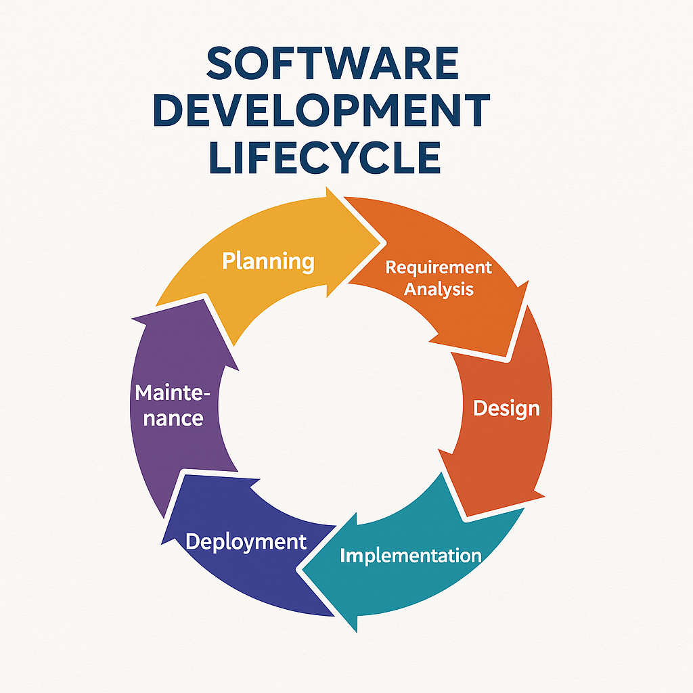
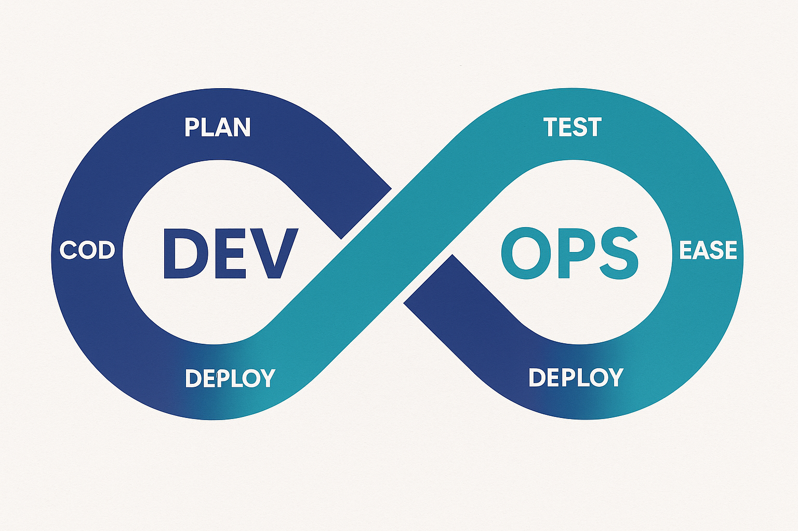

<h1>📘 SDLC & DevOps Lifecycle – Full Toolchain & Architecture Mapping</h1>

This document describes how traditional Software Development Life Cycle (SDLC) integrates seamlessly with DevOps to deliver scalable, secure, and resilient cloud-native applications.

<h2>📌 SDLC Lifecycle Overview</h2>

<strong>Software Development Life Cycle (SDLC)</strong> outlines the standard phases of application development from idea to maintenance. It includes:

<ol>
  <li>Planning</li>
  <li>Requirement Analysis</li>
  <li>Design</li>
  <li>Implementation</li>
  <li>Testing</li>
  <li>Deployment</li>
  <li>Maintenance</li>
</ol>

<h2>⚙️ DevOps Infinity Loop</h2>

<strong>DevOps</strong> brings automation, monitoring, feedback, and agility to SDLC. It’s a culture that emphasizes collaboration between Development and Operations through CI/CD, cloud, observability, and security tools.

Common DevOps Stages:

<ul>
  <li>Plan</li>
  <li>Develop</li>
  <li>Build</li>
  <li>Test</li>
  <li>Release</li>
  <li>Deploy</li>
  <li>Operate</li>
  <li>Monitor</li>
</ul>

<h2>🛠️ DevOps Tools by Stage</h2>

<table border="1" cellspacing="0" cellpadding="6">
  <thead>
    <tr><th>DevOps Stage</th><th>Tools / Technologies</th></tr>
  </thead>
  <tbody>
    <tr><td>Plan</td><td>Jira, Azure Boards, GitHub Projects, Notion</td></tr>
    <tr><td>Develop</td><td>Spring Boot ✅, Python ✅, GitHub, GitLab, Git CLI</td></tr>
    <tr><td>Build</td><td>Maven ✅, Jenkins ✅, GitHub Actions ✅, Azure DevOps ✅</td></tr>
    <tr><td>Test</td><td>Postman, JUnit, SonarQube ✅, Trivy ✅, OWASP ZAP</td></tr>
    <tr><td>Release</td><td>GitHub Actions ✅, Jenkins Pipelines ✅, Argo CD ✅</td></tr>
    <tr><td>Deploy</td><td>Kubernetes ✅, Helm ✅, Terraform ✅, Ansible ✅, Istio ✅</td></tr>
    <tr><td>Operate</td><td>Prometheus ✅, Grafana ✅, ELK, Splunk ✅</td></tr>
    <tr><td>Monitor</td><td>OpenTelemetry ✅, Quantum Metric ✅, Azure Monitor, CloudWatch</td></tr>
  </tbody>
</table>

<h2>🧩 Cloud & Messaging Technologies</h2>

<table border="1" cellspacing="0" cellpadding="6">
  <thead>
    <tr><th>Category</th><th>Technologies</th></tr>
  </thead>
  <tbody>
    <tr>
      <td><strong>Cloud Providers</strong></td>
      <td>
        Azure ✅ (AKS, Key Vault, DevOps, Front Door), 
        AWS ✅ (EKS, EC2, CloudFront), 
        KIND ✅ (for local dev), GCP, OpenShift
      </td>
    </tr>
    <tr>
      <td><strong>Messaging Brokers</strong></td>
      <td>Kafka ✅, Zookeeper ✅, RabbitMQ, ActiveMQ</td>
    </tr>
    <tr>
      <td><strong>Databases</strong></td>
      <td>MySQL ✅, MongoDB ✅, Redis ✅, Oracle DB, MS SQL Server, Cosmos DB</td>
    </tr>
    <tr>
      <td><strong>Security & QA</strong></td>
      <td>Trivy ✅, SonarQube ✅, OWASP, Snyk, Checkov</td>
    </tr>
    <tr>
      <td><strong>Monitoring & Observability</strong></td>
      <td>Prometheus ✅, Grafana ✅, OpenTelemetry ✅, ELK, Splunk ✅</td>
    </tr>
  </tbody>
</table>

<h2>✅ Our Project Toolchain</h2>

<ul>
  <li><strong>Languages:</strong> Spring Boot, Python</li>
  <li><strong>Messaging:</strong> Kafka, Zookeeper</li>
  <li><strong>Database:</strong> MySQL, Redis, MongoDB</li>
  <li><strong>CI/CD:</strong> Jenkins, GitHub Actions, ArgoCD</li>
  <li><strong>Security:</strong> SonarQube, Trivy, OWASP</li>
  <li><strong>Containerization:</strong> Docker, Docker Hub, Harbor</li>
  <li><strong>Deployment:</strong> Kubernetes (Kind, AKS, EKS), Helm, Terraform, Ansible</li>
  <li><strong>Monitoring:</strong> Prometheus, Grafana, Splunk, OpenTelemetry</li>
</ul>

<h2>📚 Summary</h2>

  This documentation provides a unified view of SDLC and DevOps lifecycle, aligned with modern tools and best practices. It demonstrates how our project simulates a real-world microservices deployment pipeline using:
  <strong>CI/CD + Containers + Cloud + Security + Monitoring</strong>

<strong>See Also:</strong>

<ul>
  <li><a href="https://github.com/praveen581348/project_allinone">README.md – Project Introduction</a></li>
  <li><a href="./application_flow.md">application_flow.md – Microservices Architecture</a></li>
</ul>
<h2>📚 Resources</h2>
<ol>
  <!-- GitHub Repos & Overviews -->
  <li>📦 <a href="https://github.com/praveen581348/project_allinone" target="_blank">GitHub: project_allinone</a></li>
   <li>🔁 <a href="https://github.com/praveen581348/project_allinone/blob/master/application_flow.md" target="_blank">Application Flow (GitHub)</a></li>
  <li>📋 <a href="https://github.com/praveen581348/project_allinone/blob/master/SDLC-and-DevOps-Overview.md" target="_blank">SDLC & DevOps Overview</a></li>
  
  <!-- Docker, Kubernetes, kind -->
  <li>🚀 <a href="https://github.com/praveen581348/project_allinone/blob/master/why_docker_kubernetes_kind.md" target="_blank">Why Docker, Kubernetes & kind?</a></li>
  <li>🔧 <a href="https://github.com/praveen581348/project_allinone/blob/master/why_docker_kubernetes_kind.md" target="_blank">Setup Kind Cluster</a></li>
  <li>🌐 <a href="https://github.com/praveen581348/cluster" target="_blank">Cluster Repository</a></li>
  
  <!-- Docker -->
  <li>🐳 <a href="https://chatgpt.com/share/6857d18a-a8c0-8001-9c67-850a90e9ddbe" target="_blank">Learn Docker (ChatGPT)</a></li>
  
  <!-- Kubernetes -->
  <li>☸️ <a href="https://chatgpt.com/share/6857e648-5de0-8001-ab14-7897f0aa5989" target="_blank">Learn Kubernetes (ChatGPT)</a></li>
  
  <!-- kind -->
  <li>🧪 <a href="https://chatgpt.com/share/6857e7f1-2d24-8001-88c5-41d0bf8c0c51" target="_blank">Learn kind Cluster (ChatGPT)</a></li>
  
  <!-- Spring Boot + Maven -->
  <li>🛠️ <a href="https://github.com/praveen581348/project_allinone/blob/master/why_springboot_maven.md" target="_blank">Why Spring Boot + Maven?</a></li>
  <li>🌱 <a href="https://chatgpt.com/share/685854c4-f9b4-8001-a16d-bab5320f29d5" target="_blank">Spring Boot Notes & Concepts (ChatGPT)</a></li>
  <li>📘 <a href="https://chatgpt.com/share/6859922a-e6f4-8001-864e-ba59b47ad706" target="_blank">Maven Notes (ChatGPT)</a></li>
  
  <!-- Kafka + ZooKeeper -->
  <li>📡 <a href="https://github.com/praveen581348/project_allinone/blob/master/setup_kafka_zookpeer.md" target="_blank">Setup Kafka & ZooKeeper (GitHub)</a></li>
  <li>📄 <a href="https://chatgpt.com/share/685d3b2e-485c-8001-bc5c-8c3702594e35" target="_blank">Kafka & ZooKeeper Concepts & Architecture (ChatGPT)</a></li>
  <li>📂 <a href="https://github.com/praveen581348/kafka_zookeeper" target="_blank">Kafka & ZooKeeper Repository</a></li>

   <!-- SenderService -->
   <li>🚀 <a href="https://github.com/praveen581348/project_allinone/blob/master/create_senderservice.md" target="_blank">Create SenderService – Spring Boot Kafka Producer</a></li>
   <li>📁 <a href="https://github.com/praveen581348/senderservice" target="_blank">SenderService Git Repository</a></li>
    <li>📦 <a href="https://github.com/praveen581348/project_allinone/blob/master/run_senderservice_as_pod.md" target="_blank">Run SenderService as a Pod (Kubernetes Deployment Guide)</a></li>
    <li>✅ <a href="https://github.com/praveen581348/project_allinone/blob/master/verify_senderservice_kafka.md" target="_blank">Verify SenderService Producing to Kafka</a></li>

    <!-- MySQL -->
  <li>🗄️ <a href="github.com/praveen581348/project_allinone/blob/master/setup_mysql.md" target="_blank">Setup MySQL User Guide</a></li>
  <li>💾 <a href="https://github.com/praveen581348/mysql" target="_blank">MySQL Repository</a></li>

  <!-- Redis -->
  <li>⚡ <a href="https://github.com/praveen581348/project_allinone/blob/master/what_is_Redis.md" target="_blank">What is Redis?</a></li>
  <li>🔴 <a href="https://github.com/praveen581348/project_allinone/blob/master/setup_redis_guide.md" target="_blank">Setup Redis Guide</a></li>
  <li>📚 <a href="https://github.com/praveen581348/redis" target="_blank">Redis Repository</a></li>

  <!-- MongoDB -->
  <li>🍃 <a href="https://github.com/praveen581348/project_allinone/blob/master/setup_mongodb.md" target="_blank">MongoDB Setup Guide</a></li>
  <li>🧩 <a href="https://github.com/praveen581348/mongodb" target="_blank">MongoDB Repository</a></li>

</ol>