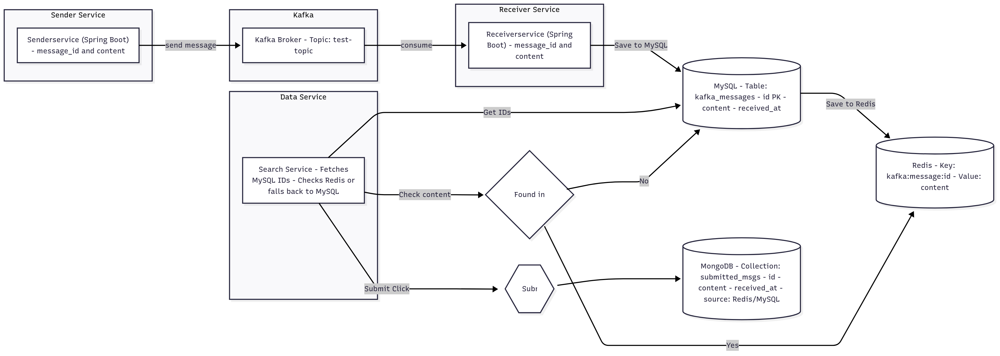

<h1>📘 Application Flow Documentation</h1>

This document provides a comprehensive overview of the end-to-end architecture, flow, and interactions between different microservices and databases in the project.

<h2>🧭 Architecture Diagram</h2>

  

<h2>🚀 Explanation of Key Steps & Components</h2>

<h3>1. Sender Service (Spring Boot)</h3>
<ul>
  <li>Hosts a simple web form.</li>
  <li>User enters a <code>message_id</code> and <code>content</code> and clicks <strong>Send</strong>.</li>
  <li>This data is published to a Kafka topic: <code>test-topic</code>.</li>
</ul>

<h3>2. Kafka Broker (Pod)</h3>
<ul>
  <li>Acts as a message queue between producer (Sender Service) and consumer (Receiver Service).</li>
  <li>Ensures asynchronous communication and resilience.</li>
</ul>

<h3>3. Receiver Service (Spring Boot)</h3>
<ul>
  <li>Consumes messages from Kafka.</li>
  <li>Displays each message on a dashboard with an action to <strong>Save to MySQL</strong>.</li>
</ul>

<h3>4. MySQL (Pod)</h3>
<ul>
  <li>Stores messages persistently with fields: <code>id</code>, <code>content</code>, and <code>received_at</code>.</li>
  <li>Acts as the authoritative system of record.</li>
</ul>

<h3>5. Redis (Pod)</h3>
<ul>
  <li>Optimizes reads by acting as a caching layer.</li>
  <li>Stores entries from MySQL in format: <code>kafka:message:<id></code> → <code>content</code>.</li>
  <li>Used when "Save All MySQL Messages to Redis" is triggered.</li>
</ul>

<h3>6. Data Service (Python App)</h3>
<ul>
  <li>Dropdown interface displays all <code>message_ids</code> from MySQL.</li>
  <li>Upon selecting an ID and clicking <strong>Search</strong>:
    <ul>
      <li>It first checks Redis for the message.</li>
      <li>If not found, it falls back to MySQL.</li>
    </ul>
  </li>
  <li>Displays content and source (Redis or MySQL).</li>
  <li>On <strong>Submit</strong>, it stores the final data into MongoDB.</li>
</ul>

<h3>7. MongoDB (Pod)</h3>
<ul>
  <li>Stores all submitted messages with fields: <code>id</code>, <code>content</code>, <code>received_at</code>, and <code>source</code>.</li>
  <li>Acts as a historical and analytical data store.</li>
</ul>

<h2>🧩 Roles & Benefits of Each Component</h2>

<table border="1" cellpadding="10">
  <thead>
    <tr>
      <th>Component</th>
      <th>Role</th>
      <th>Benefits</th>
    </tr>
  </thead>
  <tbody>
    <tr>
      <td><strong>Kafka</strong></td>
      <td>Message Queue</td>
      <td>Decouples sender & receiver, ensuring scalability and async communication.</td>
    </tr>
    <tr>
      <td><strong>MySQL</strong></td>
      <td>Primary Database</td>
      <td>Stores validated and received Kafka messages for persistence.</td>
    </tr>
    <tr>
      <td><strong>Redis</strong></td>
      <td>Caching Layer</td>
      <td>Improves read performance for frequent lookups by storing MySQL data.</td>
    </tr>
    <tr>
      <td><strong>MongoDB</strong></td>
      <td>Final Data Store</td>
      <td>Stores full user-submitted data with context for history or audits.</td>
    </tr>
    <tr>
      <td><strong>Search/Data Service</strong></td>
      <td>Lookup and Store Logic</td>
      <td>Implements intelligent caching by querying Redis first and falling back to MySQL.</td>
    </tr>
  </tbody>
</table>

<h2>📦 Summary</h2>

<ul>
  <li>This architecture demonstrates a modern microservice pattern combining message queues, caching, and persistent databases.</li>
  <li>Each layer improves modularity, performance, or traceability.</li>
  <li>The application is well-suited for analytical pipelines, dashboards, and user interaction-based message processing.</li>
</ul>

<strong>📁 Image File:</strong> <code>app_flow.png</code> (Place this in the same GitHub repository folder)

