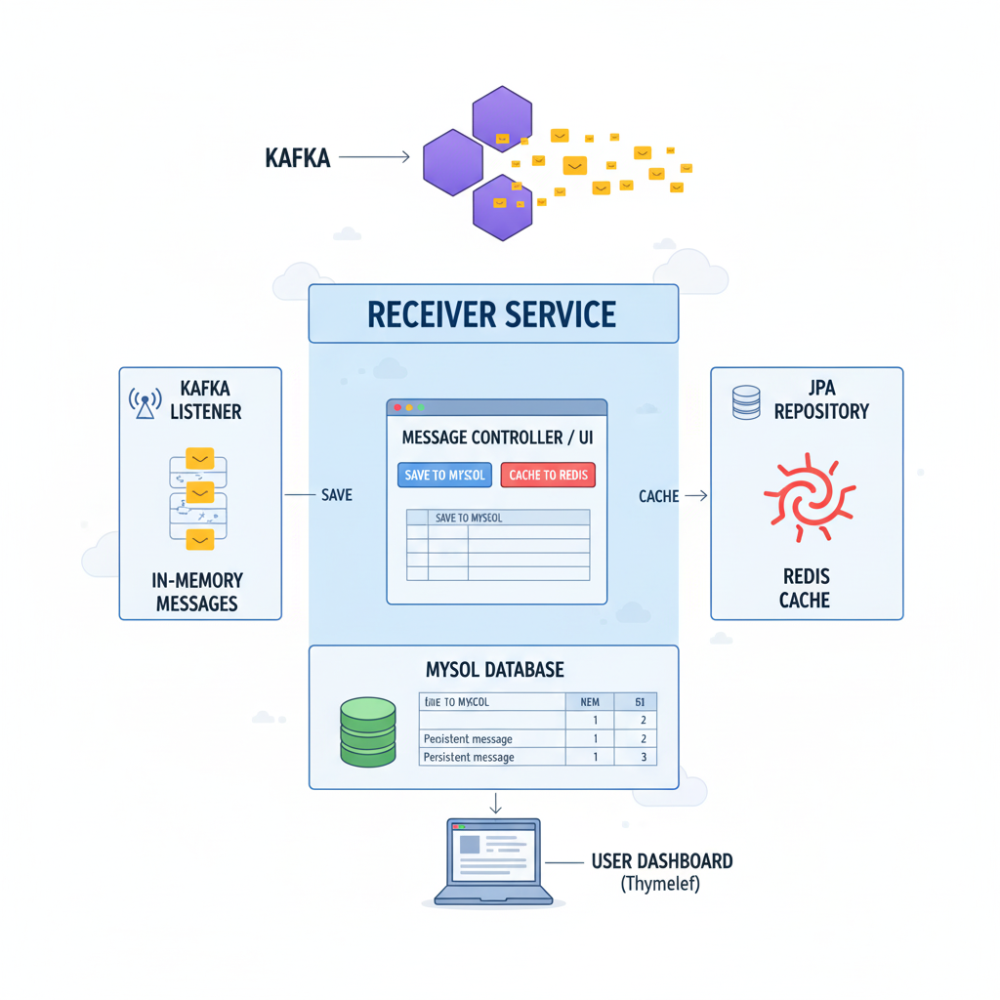

<h1 align="center" style="color:#2F80ED; border-bottom: 3px solid #2F80ED; padding-bottom: 10px;">
    ⚙️ Receiver Service: Core Design and Documentation
</h1>

  

    This Spring Boot microservice completes the core data flow: consuming messages from <strong>Kafka</strong>, persisting them to <strong>MySQL</strong>, and implementing caching with <strong>Redis</strong>.

<h2>📁 Project Structure</h2>

    The project is organized using a clean, domain-driven structure to separate concerns:

<pre><code>src/main/java/com/example/receiverservice/
├── ReceiverServiceApplication.java   # Application Entry Point
├── cache/
│   └── MessageCacheService.java      # Redis caching logic
├── controller/
│   └── MessageController.java        # MVC/UI routing and action handling
├── entity/
│   └── KafkaMessage.java             # JPA Entity for MySQL
├── kafka/
│   └── ReceiverService.java          # Kafka consumer and in-memory storage
├── repository/
│   └── KafkaMessageRepository.java   # JPA interface for MySQL operations
src/main/resources/
├── templates/
│   └── messages.html                 # Thymeleaf Dashboard UI
└── application.properties            # K8s service configuration
</code></pre>

<h2>🧠 Core Functionality and Design</h2>

    The service implements a <strong>manual, user-controlled data flow</strong> to explicitly demonstrate each interaction:

<h3>Data Flow Summary</h3>
<table style="width:100%; border-collapse: collapse; margin-bottom: 20px;">
    <thead>
        <tr style="background-color: #f0f0f0;">
            <th style="padding: 10px; border: 1px solid #ddd;">Component</th>
            <th style="padding: 10px; border: 1px solid #ddd;">Role in the Data Pipeline</th>
            <th style="padding: 10px; border: 1px solid #ddd;">Key Action</th>
        </tr>
    </thead>
    <tbody>
        <tr>
            <td style="padding: 10px; border: 1px solid #ddd;"><strong>Kafka Listener</strong></td>
            <td style="padding: 10px; border: 1px solid #ddd;"><strong>Consume & Hold (In-Memory)</strong></td>
            <td style="padding: 10px; border: 1px solid #ddd;">Temporarily stores messages until persistence is triggered.</td>
        </tr>
        <tr>
            <td style="padding: 10px; border: 1px solid #ddd;"><strong>MySQL (JPA)</strong></td>
            <td style="padding: 10px; border: 1px solid #ddd;"><strong>Persistence</strong></td>
            <td style="padding: 10px; border: 1px solid #ddd;">Saves messages when the "Save to MySQL" action is requested via UI.</td>
        </tr>
        <tr>
            <td style="padding: 10px; border: 1px solid #ddd;"><strong>Redis Cache</strong></td>
            <td style="padding: 10px; border: 1px solid #ddd;"><strong>Performance</strong></td>
            <td style="padding: 10px; border: 1px solid #ddd;">Caches persisted data (Key: <code>message:&lt;id&gt;</code>) to accelerate lookups.</td>
        </tr>
        <tr>
            <td style="padding: 10px; border: 1px solid #ddd;"><strong>Thymeleaf UI</strong></td>
            <td style="padding: 10px; border: 1px solid #ddd;"><strong>Visualization</strong></td>
            <td style="padding: 10px; border: 1px solid #ddd;">Displays two tables: **Live/Unstored** and **Persisted**.</td>
        </tr>
    </tbody>
</table>

<h2>⚙️ Configuration & Service Discovery</h2>

    The application uses **Kubernetes DNS** to establish robust connections to all external services, guaranteeing the microservice can find its dependencies.

<h3><code>application.properties</code> Summary</h3>
<table style="width:100%; border-collapse: collapse; margin-bottom: 20px;">
    <thead>
        <tr style="background-color: #f0f0f0;">
            <th style="padding: 10px; border: 1px solid #ddd;">Service</th>
            <th style="padding: 10px; border: 1px solid #ddd;">Property</th>
            <th style="padding: 10px; border: 1px solid #ddd;">Value (K8s DNS Name)</th>
        </tr>
    </thead>
    <tbody>
        <tr>
            <td style="padding: 10px; border: 1px solid #ddd;"><strong>MySQL</strong></td>
            <td style="padding: 10px; border: 1px solid #ddd;"><code>spring.datasource.url</code></td>
            <td style="padding: 10px; border: 1px solid #ddd;"><code>jdbc:mysql://mysql.database.svc.cluster.local:3306/crud...</code></td>
        </tr>
        <tr>
            <td style="padding: 10px; border: 1px solid #ddd;"><strong>Kafka</strong></td>
            <td style="padding: 10px; border: 1px solid #ddd;"><code>spring.kafka.bootstrap-servers</code></td>
            <td style="padding: 10px; border: 1px solid #ddd;"><code>kafka.messaging.svc.cluster.local:9092</code></td>
        </tr>
        <tr>
            <td style="padding: 10px; border: 1px solid #ddd;"><strong>Redis</strong></td>
            <td style="padding: 10px; border: 1px solid #ddd;"><code>spring.data.redis.host</code></td>
            <td style="padding: 10px; border: 1px solid #ddd;"><code>redis.cache.svc.cluster.local</code></td>
        </tr>
    </tbody>
</table>

<h2>💡 Detailed File Purpose</h2>

<table style="width:100%; border-collapse: collapse; margin-bottom: 20px;">
    <thead>
        <tr style="background-color: #f0f0f0;">
            <th style="padding: 10px; border: 1px solid #ddd;">File</th>
            <th style="padding: 10px; border: 1px solid #ddd;">Core Logic/Function</th>
            <th style="padding: 10px; border: 1px solid #ddd;">Key Technology</th>
        </tr>
    </thead>
    <tbody>
        <tr>
            <td style="padding: 10px; border: 1px solid #ddd;"><strong><code>ReceiverService.java</code></strong></td>
            <td style="padding: 10px; border: 1px solid #ddd;"><strong>Kafka Listener:</strong> Consumes messages and stores them in a temporary in-memory list.</td>
            <td style="padding: 10px; border: 1px solid #ddd;"><code>@KafkaListener</code></td>
        </tr>
        <tr>
            <td style="padding: 10px; border: 1px solid #ddd;"><strong><code>MessageCacheService.java</code></strong></td>
            <td style="padding: 10px; border: 13px solid #ddd;"><strong>Caching:</strong> Implements <code>saveAllToCache()</code> using <code>StringRedisTemplate</code>.</td>
            <td style="padding: 10px; border: 1px solid #ddd;"><code>Spring Data Redis</code></td>
        </tr>
        <tr>
            <td style="padding: 10px; border: 1px solid #ddd;"><strong><code>MessageController.java</code></strong></td>
            <td style="padding: 10px; border: 1px solid #ddd;"><strong>MVC/API:</strong> Exposes UI and handles POST requests for saving data to MySQL and Redis.</td>
            <td style="padding: 10px; border: 1px solid #ddd;"><code>@Controller</code>, MVC</td>
        </tr>
        <tr>
            <td style="padding: 10px; border: 1px solid #ddd;"><strong><code>KafkaMessage.java</code></strong></td>
            <td style="padding: 10px; border: 1px solid #ddd;"><strong>Persistence:</strong> JPA <code>@Entity</code> mapping the data structure to the MySQL table.</td>
            <td style="padding: 10px; border: 1px solid #ddd;"><code>Spring Data JPA</code></td>
        </tr>
        <tr>
            <td style="padding: 10px; border: 1px solid #ddd;"><strong><code>messages.html</code></strong></td>
            <td style="padding: 10px; border: 1px solid #ddd;"><strong>Dashboard:</strong> Thymeleaf logic for visualizing the live Kafka data vs. the persisted MySQL data.</td>
            <td style="padding: 10px; border: 1px solid #ddd;">Thymeleaf</td>
        </tr>
    </tbody>
</table>

