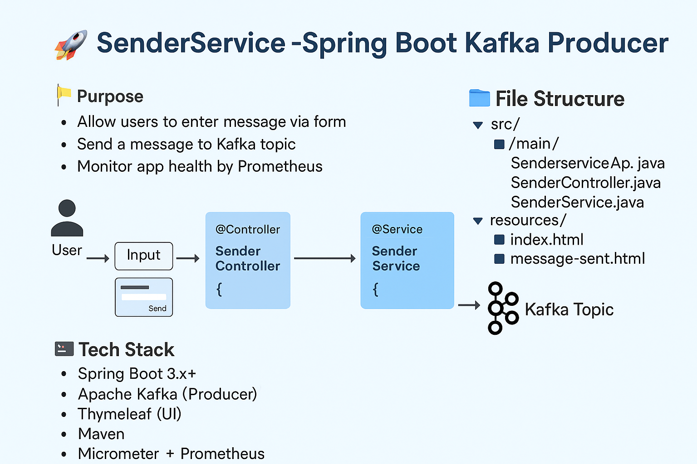

<!-- BEGIN HTML --> 
<h1>🚀 SenderService – Spring Boot Kafka Producer</h1> 

 <strong>SenderService</strong> is a Spring Boot microservice designed to produce messages to Apache Kafka. It includes a simple HTML frontend, connects to Kafka via <code>spring-kafka</code>, and is part of our end-to-end microservices system. 
 

 

  

<h2>📌 Why Spring Boot?</h2> 
<ul> 
<li>⚙️ <strong>Auto-configuration:</strong> Minimizes boilerplate and config</li> 
<li>🌐 <strong>Embedded Server:</strong> Includes Tomcat – no external deployment needed</li> 
<li>📦 <strong>Dependency Management:</strong> Spring Boot starters simplify Maven setup</li> 
<li>🧩 <strong>Microservices Ready:</strong> Fast to build & scale independently</li> 
</ul> 
 
<h2>🌱 Project Creation via Spring Initializr</h2> 

 We used <a href="https://start.spring.io/" target="_blank">Spring Initializr</a> to bootstrap the application. 
 
<ul> 
<li>Build Tool: Maven</li> <li>Language: Java</li> <li>Spring Boot Version: 3.x+</li> <li>Dependencies: <ul> <li>Spring Web</li>
 <li>Thymeleaf</li>
  <li>Spring Kafka</li>
   <li>Spring Boot Actuator</li>
    <li>Micrometer (Prometheus)</li> 
    </ul> 
    </li>
     </ul> 
     
 
     <h2>📁 Project Structure</h2> 
     <pre><code>senderservice/ ├── src/ │ └── main/ │ ├── java/com/example/senderservice/ │ │ ├── controller/SenderController.java │ │ ├── kafka/SenderService.java │ │ └── SenderserviceApplication.java │ └── resources/ │ ├── static/ │ ├── templates/ │ │ ├── index.html │ │ └── message-sent.html │ └── application.properties ├── test/ ├── pom.xml </code>
     </pre> 
     

      <h2>🧠 File-by-File Explanation</h2> 
      <h3>1. <code>SenderserviceApplication.java</code></h3> 
      <pre><code>@SpringBootApplication public class SenderserviceApplication { public static void main(String[] args) { SpringApplication.run(SenderserviceApplication.class, args); } } </code></pre> 
      
<strong>Purpose:</strong> Application entry point.
 
      <h3>2. <code>SenderController.java</code></h3> 
      <pre><code>@Controller public class SenderController { @Autowired private SenderService senderService;

@GetMapping("/")
public String index() {
    return "index";
}

@PostMapping("/send")
public String send(@RequestParam("message") String message) {
    senderService.sendMessage(message);
    return "message-sent";
}
}
</code></pre>

<strong>Purpose:</strong> Renders form (GET /), processes form (POST /send), and invokes Kafka producer.
 <h3>3. <code>SenderService.java</code></h3> <pre><code>@Service public class SenderService {

@Value("${kafka.bootstrap.servers}")
private String bootstrapServers;

public void sendMessage(String message) {
    Properties props = new Properties();
    props.put("bootstrap.servers", bootstrapServers);
    props.put("key.serializer", StringSerializer.class.getName());
    props.put("value.serializer", StringSerializer.class.getName());

    KafkaProducer<String, String> producer = new KafkaProducer<>(props);
    producer.send(new ProducerRecord<>("test-topic", message));
    producer.close();
}
}
</code></pre>

<strong>Purpose:</strong> Sends messages to Kafka topic 
<code>test-topic</code>.
 
<h3>4. <code>index.html</code>
</h3> <pre><code>&lt;form action="/send" method="POST"&gt; &lt;input type="text" name="message" placeholder="Enter message" required/&gt; &lt;button type="submit"&gt;Send&lt;/button&gt; &lt;/form&gt; </code></pre> 

<strong>Purpose:</strong> UI for user to enter message.
 
<h3>5. <code>message-sent.html</code></h3>
 <pre><code>&lt;h2&gt;Message Sent Successfully!&lt;/h2&gt; &lt;a href="/"&gt;Back to Home&lt;/a&gt; </code></pre> 
<strong>Purpose:</strong> Confirmation after message is sent.
 <h3>6. <code>application.properties</code></h3> <pre><code>spring.application.name=senderservice server.port=8098
kafka.bootstrap.servers=kafka.messaging.svc.cluster.local:9092

management.endpoints.web.exposure.include=prometheus
management.prometheus.metrics.export.enabled=true

logging.pattern.console=%d{yyyy-MM-dd HH:mm:ss} - %msg%n
logging.level.root=INFO
</code></pre>

<strong>Purpose:</strong> App configs – Kafka bootstrap, Prometheus, logging, etc.
 <h3>7. <code>pom.xml</code></h3> 
<pre><code>&lt;dependencies&gt; &lt;dependency&gt; &lt;groupId&gt;org.springframework.boot&lt;/groupId&gt; &lt;artifactId&gt;spring-boot-starter-web&lt;/artifactId&gt; &lt;/dependency&gt; &lt;dependency&gt; &lt;groupId&gt;org.springframework.boot&lt;/groupId&gt; &lt;artifactId&gt;spring-boot-starter-thymeleaf&lt;/artifactId&gt; &lt;/dependency&gt; &lt;dependency&gt; &lt;groupId&gt;org.springframework.kafka&lt;/groupId&gt; &lt;artifactId&gt;spring-kafka&lt;/artifactId&gt; &lt;/dependency&gt; &lt;dependency&gt; &lt;groupId&gt;io.micrometer&lt;/groupId&gt; &lt;artifactId&gt;micrometer-registry-prometheus&lt;/artifactId&gt; &lt;/dependency&gt; &lt;dependency&gt; &lt;groupId&gt;org.springframework.boot&lt;/groupId&gt; &lt;artifactId&gt;spring-boot-starter-actuator&lt;/artifactId&gt; &lt;/dependency&gt; &lt;/dependencies&gt; </code></pre> 
<strong>Purpose:</strong> Dependency management, monitoring, web UI, Kafka, Prometheus support
 
 <h2>🔁 Full Request Flow</h2> 
<ol> 
<li>🔗 User opens <code>http://localhost:8098/</code> → index.html rendered</li>
 <li>📝 User submits a message</li> <li>☁️ POST /send → SenderController.sendMessage() is called</li> <li>📨 SenderService sends the message to Kafka</li> <li>✅ Confirmation page <code>message-sent.html</code> is shown</li>
  </ol> 
  
 <h2>🧪 Local Testing</h2> <pre><code># Build and run the app mvn clean install mvn spring-boot:run
Test URL:
http://localhost:8098/
</code></pre>

 

<h2>📚 Resources</h2>
<ol>
  <!-- GitHub Repos & Overviews -->
  <li>📦 <a href="https://github.com/praveen581348/project_allinone" target="_blank">GitHub: project_allinone</a></li>
   <li>🔁 <a href="https://github.com/praveen581348/project_allinone/blob/master/application_flow.md" target="_blank">Application Flow (GitHub)</a></li>
  <li>📋 <a href="https://github.com/praveen581348/project_allinone/blob/master/SDLC-and-DevOps-Overview.md" target="_blank">SDLC & DevOps Overview</a></li>
  
  <!-- Docker, Kubernetes, kind -->
  <li>🚀 <a href="https://github.com/praveen581348/project_allinone/blob/master/why_docker_kubernetes_kind.md" target="_blank">Why Docker, Kubernetes & kind?</a></li>
  <li>🔧 <a href="https://github.com/praveen581348/project_allinone/blob/master/why_docker_kubernetes_kind.md" target="_blank">Setup Kind Cluster</a></li>
  <li>🌐 <a href="https://github.com/praveen581348/cluster" target="_blank">Cluster Repository</a></li>
  
  <!-- Docker -->
  <li>🐳 <a href="https://chatgpt.com/share/6857d18a-a8c0-8001-9c67-850a90e9ddbe" target="_blank">Learn Docker (ChatGPT)</a></li>
  
  <!-- Kubernetes -->
  <li>☸️ <a href="https://chatgpt.com/share/6857e648-5de0-8001-ab14-7897f0aa5989" target="_blank">Learn Kubernetes (ChatGPT)</a></li>
  
  <!-- kind -->
  <li>🧪 <a href="https://chatgpt.com/share/6857e7f1-2d24-8001-88c5-41d0bf8c0c51" target="_blank">Learn kind Cluster (ChatGPT)</a></li>
  
  <!-- Spring Boot + Maven -->
  <li>🛠️ <a href="https://github.com/praveen581348/project_allinone/blob/master/why_springboot_maven.md" target="_blank">Why Spring Boot + Maven?</a></li>
  <li>🌱 <a href="https://chatgpt.com/share/685854c4-f9b4-8001-a16d-bab5320f29d5" target="_blank">Spring Boot Notes & Concepts (ChatGPT)</a></li>
  <li>📘 <a href="https://chatgpt.com/share/6859922a-e6f4-8001-864e-ba59b47ad706" target="_blank">Maven Notes (ChatGPT)</a></li>
  
  <!-- Kafka + ZooKeeper -->
  <li>📡 <a href="https://github.com/praveen581348/project_allinone/blob/master/setup_kafka_zookpeer.md" target="_blank">Setup Kafka & ZooKeeper (GitHub)</a></li>
  <li>📄 <a href="https://chatgpt.com/share/685d3b2e-485c-8001-bc5c-8c3702594e35" target="_blank">Kafka & ZooKeeper Concepts & Architecture (ChatGPT)</a></li>
  <li>📂 <a href="https://github.com/praveen581348/kafka_zookeeper" target="_blank">Kafka & ZooKeeper Repository</a></li>

   <!-- SenderService -->
   <li>🚀 <a href="https://github.com/praveen581348/project_allinone/blob/master/create_senderservice.md" target="_blank">Create SenderService – Spring Boot Kafka Producer</a></li>
   <li>📁 <a href="https://github.com/praveen581348/senderservice" target="_blank">SenderService Git Repository</a></li>

</ol>