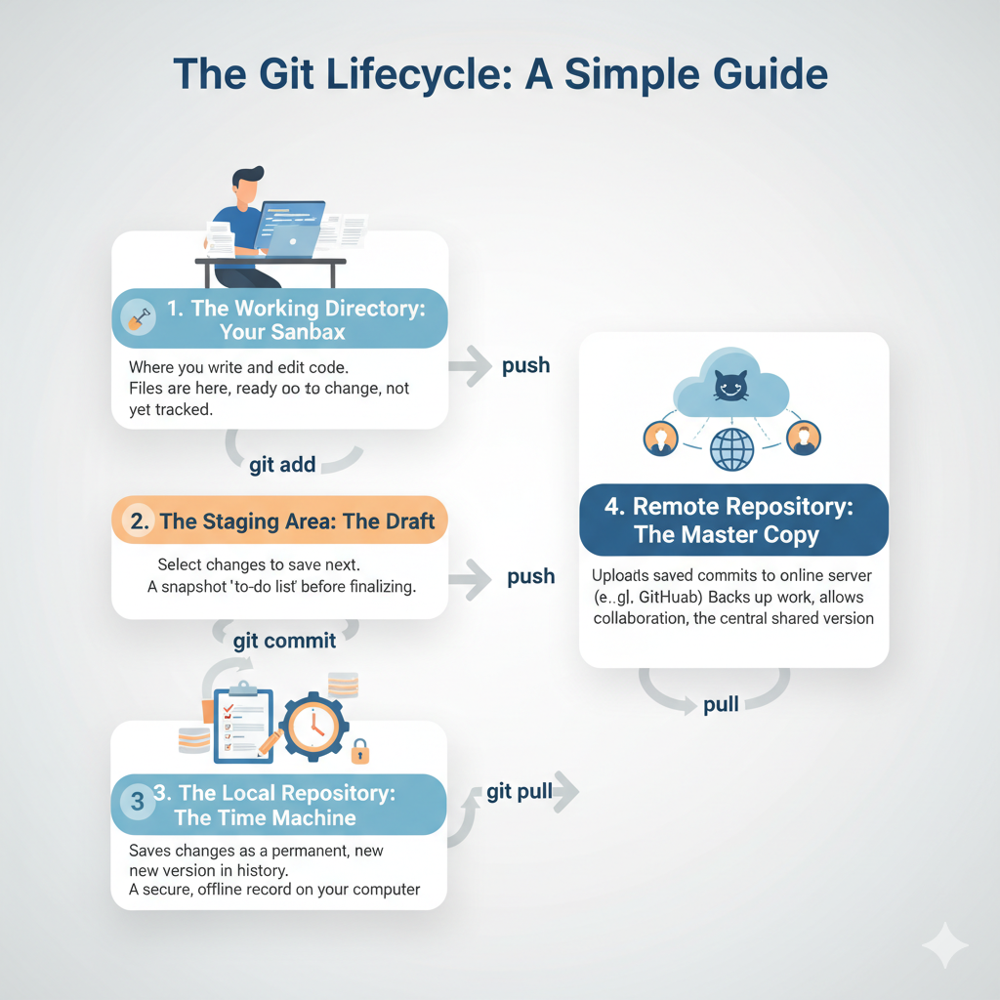

    <h2 style="color:#0056b3;">Git and GitHub: A Simple Explanation</h2>
    

    

        <strong>Git</strong> is a tool you install on your computer that lets you save different versions of your project. It's like a special "save" button that keeps a complete history of every change you make. This means you can go back to any past version of your project and see exactly what was changed.
    

    

        <strong>GitHub</strong> is a website that lets you put your Git projects online. It's like an online storage hub for your code. This allows you to:
    

    <ul style="font-size:16px;">
        <li><strong>Back up your work</strong> in the cloud.</li>
        <li><strong>Share your project</strong> with others.</li>
        <li><strong>Work together</strong> on the same project with other people, using features like <strong>pull requests</strong> to suggest changes and get feedback before they are added to the main project.</li>
    </ul>
    

        In short, <strong>you use Git on your local computer to track changes</strong>, and <strong>you use GitHub to share and collaborate on those changes online</strong>.
    

    <h2 style="color:#0056b3;">The Git Lifecycle: A Simple Guide</h2>
    

    

      
    

    
    <h4 style="color:#212529;">1. The Working Directory: Your Sandbox</h4>
    

        This is where you write and edit your code. All your project files are here, ready for you to change, but Git isn't actively tracking those changes yet. It's your personal, temporary workspace.
    

    

    <h4 style="color:#212529;">2. The Staging Area: The Draft</h4>
    

        When you use <code>git add</code>, you're telling Git exactly which changes you want to save next. The staging area holds this specific snapshot of changes, acting as a draft or "to-do list" before you finalize them.
    

    

    <h4 style="color:#212529;">3. The Local Repository: The Time Machine</h4>
    

        Using <code>git commit</code> saves your staged changes as a permanent, new version in your project's history. This creates a secure, offline record of your work on your computer. It's like a private photo album of every step you've taken.
    

    

    <h4 style="color:#212529;">4. The Remote Repository: The Master Copy</h4>
    

        When you <code>git push</code>, you upload your saved commits to an online server, like GitHub. This backs up your work and allows others to see your changes and collaborate. It's the central, shared version of your project for everyone on your team. 
    

<h1 style="color:#0056b3; border-bottom: 2px solid #0056b3; padding-bottom: 10px;">Git and GitHub Initial Setup Guide</h1>

This guide walks through setting up your local Git environment, creating a new empty GitHub repository, and pushing your existing code for the very first time.

<h2 style="color:#28a745;">1. Initial Local Git Setup (Run Once)</h2>

These commands ensure your commits are correctly tagged with your identity. Run these in your command line/terminal.

<h4 style="color:#212529;">Set Username:</h4>
<pre style="background-color:#e9ecef; padding:10px; border-radius:4px; overflow-x:auto;"><code>git config --global user.name "Your Name"</code></pre>

<h4 style="color:#212529;">Set Email:</h4>
<pre style="background-color:#e9ecef; padding:10px; border-radius:4px; overflow-x:auto;"><code>git config --global user.email "your.email@example.com"</code></pre>

<h2 style="color:#28a745;">2. Prepare the Remote Repository (GitHub)</h2>
<ol style="font-size:16px;">
    <li>Log in to your **new GitHub account**.</li>
    <li>Click the <strong>'+'</strong> sign &rarr; <strong>New repository</strong>.</li>
    <li>Enter the **Repository Name** (e.g., <code>my-new-project</code>).</li>
    <li>Ensure the crucial box, <strong>"Initialize this repository with a README," is UNCHECKED</strong>.</li>
    <li>Click **"Create repository"**.</li>
    <li><strong>Copy the Remote URL</strong> (it will look like <code>https://github.com/YourUsername/my-new-project.git</code>) from the displayed setup page.</li>
</ol>

<h2 style="color:#28a745;">3. Local Project Initialization and First Commit</h2>

Navigate to your existing project folder in the terminal (e.g., <code>cd my-new-project</code>).

<h4 style="color:#212529;">A. Initialize Git in the project folder:</h4>
<pre style="background-color:#e9ecef; padding:10px; border-radius:4px; overflow-x:auto;"><code>git init</code></pre>

<h4 style="color:#212529;">B. Stage all existing files:</h4>
<pre style="background-color:#e9ecef; padding:10px; border-radius:4px; overflow-x:auto;"><code>git add .</code></pre>

<h4 style="color:#212529;">C. Create the first permanent snapshot (commit):</h4>
<pre style="background-color:#e9ecef; padding:10px; border-radius:4px; overflow-x:auto;"><code>git commit -m "Initial project structure and files"</code></pre>

<h2 style="color:#28a745;">4. Linking Local Git to GitHub</h2>

<h4 style="color:#212529;">A. Link the local repository to the remote URL:</h4>

Replace the URL below with the one you copied from GitHub.

<pre style="background-color:#e9ecef; padding:10px; border-radius:4px; overflow-x:auto;"><code>git remote add origin https://github.com/YourUsername/my-new-project.git</code></pre>

<h4 style="color:#212529;">B. Rename the default branch (Recommended):</h4>
<pre style="background-color:#e9ecef; padding:10px; border-radius:4px; overflow-x:auto;"><code>git branch -M main</code></pre>

<h4 style="color:#212529;">C. Push your code to GitHub (First Push):</h4>

The <code>-u</code> flag sets up tracking so future pushes are just <code>git push</code>.

<pre style="background-color:#e9ecef; padding:10px; border-radius:4px; overflow-x:auto;"><code>git push -u origin main</code></pre>

✅ **Success!** Your local code is now backed up and visible on your new GitHub repository.

    <h1 style="color:#0056b3; border-bottom: 3px solid #0056b3; padding-bottom: 10px;">Git Change Management & Undoing Mistakes: A Simple Guide 🛠️</h1>
    

        This guide simplifies the core Git commands used to manage and reverse changes, differentiating between local fixes and shared history corrections.
    

    <h2 style="color:#28a745; margin-top: 25px;">I. The Three Local Areas in Git</h2>
    

        To choose the right undo command, know where your file lives:
    

    <ul style="font-size:16px;">
        <li><strong>Working Directory:</strong> Your files on disk. (Where you *type*.)</li>
        <li><strong>Staging Area:</strong> The "draft" of the next commit. (Where you run <code>git add</code>.)</li>
        <li><strong>Local Repository:</strong> The saved history/snapshots. (Where you run <code>git commit</code>.)</li>
    </ul>

    

    <h2 style="color:#28a745;">II. Commands for Discarding Local Changes (Pre-Commit)</h2>
    

        These commands affect only files in the <strong>Working Directory</strong> and <strong>Staging Area</strong>. They do <strong>not</strong> touch the commit history.
    

    

        <h4 style="color:#212529;">1. <code>git checkout &lt;file&gt;</code> / <code>git restore &lt;file&gt;</code></h4>
        

            <strong>Simple Terms:</strong> "Throw away my unsaved work on this file."
             
            <strong>Effect:</strong> Discards modified content, reverting the file to the state of the <strong>Last Commit</strong>.
             
            <strong>Example:</strong> You ruined <code>script.py</code>. <code>git checkout script.py</code> restores it. **Changes are lost.**
        

    

    

        <h4 style="color:#212529;">2. <code>git restore --staged &lt;file&gt;</code></h4>
        

            <strong>Simple Terms:</strong> "Wait, I didn't mean to <code>add</code> that yet!"
             
            <strong>Effect:</strong> Moves the file from the Staging Area back to the Working Directory (as modified).
             
            <strong>Example:</strong> You staged <code>photo.jpg</code> but need to edit more. <code>git restore --staged photo.jpg</code> un-stages it. **Content is preserved.**
        

    

    <h5 style="color:#0056b3;">Sequential Diagram (Local Flow)</h5>
    <pre style="background-color:#e9ecef; padding:10px; border-radius:4px; overflow-x:auto; font-size:14px;">
Commit (C1) &rarr; Modified (Working Dir) &xrightarrow[Discards changes]{git checkout} Commit (C1)
        
Commit (C1) &rarr; Staged (Staging Area) &xrightarrow[Un-stages]{git restore --staged} Modified (Working Dir)</pre>

    

    <h2 style="color:#28a745;">III. Commands for Rewriting Private History (git reset)</h2>
    

        This is your **Time Machine** to undo local commits. It moves the <strong>HEAD</strong> pointer. **Do NOT use on shared commits.**
    

    <h5 style="color:#0056b3;">Sequential Diagram (Effect on Files After Rewind)</h5>
    

    <table style="width:100%; border-collapse: collapse; font-size:14px;">
        <tr style="background-color:#d4e8ff;">
            <th style="padding: 8px; border: 1px solid #dee2e6;">Mode</th>
            <th style="padding: 8px; border: 1px solid #dee2e6;">Command (Undo C3 &rarr; C2)</th>
            <th style="padding: 8px; border: 1px solid #dee2e6;">HEAD (History)</th>
            <th style="padding: 8px; border: 1px solid #dee2e6;">Staging Area</th>
            <th style="padding: 8px; border: 1px solid #dee2e6;">Working Directory (Files)</th>
        </tr>
        <tr>
            <td style="padding: 8px; border: 1px solid #dee2e6;"><strong>--soft</strong></td>
            <td style="padding: 8px; border: 1px solid #dee2e6;"><code>git reset --soft C2</code></td>
            <td style="padding: 8px; border: 1px solid #dee2e6;">Rewinds to <strong>C2</strong></td>
            <td style="padding: 8px; border: 1px solid #dee2e6; background-color:#e6ffed;">C3 Changes <strong>STAGED</strong></td>
            <td style="padding: 8px; border: 1px solid #dee2e6;">C3 Content Kept</td>
        </tr>
        <tr>
            <td style="padding: 8px; border: 1px solid #dee2e6;"><strong>--mixed</strong></td>
            <td style="padding: 8px; border: 1px solid #dee2e6;"><code>git reset --mixed C2</code></td>
            <td style="padding: 8px; border: 1px solid #dee2e6;">Rewinds to <strong>C2</strong></td>
            <td style="padding: 8px; border: 1px solid #dee2e6;">Staging Cleared</td>
            <td style="padding: 8px; border: 1px solid #dee2e6; background-color:#fff3cd;">C3 Content Kept <strong>(Unstaged)</strong></td>
        </tr>
        <tr style="background-color:#ffe6e6;">
            <td style="padding: 8px; border: 1px solid #dee2e6;"><strong>--hard</strong></td>
            <td style="padding: 8px; border: 1px solid #dee2e6;"><code>git reset --hard C2</code></td>
            <td style="padding: 8px; border: 1px solid #dee2e6;">Rewinds to <strong>C2</strong></td>
            <td style="padding: 8px; border: 1px solid #dee2e6;">Staging Cleared</td>
            <td style="padding: 8px; border: 1px solid #dee2e6;">Files Reverted to C2 (C3 Changes <strong>DELETED!</strong>)</td>
        </tr>
    </table>
    

    

    <h2 style="color:#28a745;">IV. Command for Safe Public Undoing (git revert)</h2>
    

        This is the **safest** way to undo a commit, especially on branches pushed to GitHub. It creates a new commit that cancels out the old one.
    

    

        <h4 style="color:#212529;"><code>git revert &lt;hash&gt;</code></h4>
        

            <strong>Simple Terms:</strong> "Create a new correction commit."
             
            <strong>Effect:</strong> A new commit is created with the inverse changes of the target commit. History is maintained.
        

    

    <h5 style="color:#0056b3;">Sequential Diagram (Non-Destructive Correction)</h5>
    <pre style="background-color:#e9ecef; padding:10px; border-radius:4px; overflow-x:auto; font-size:14px;">
History: C1 &rarr; C2 (Buggy) &rarr; C3 (Latest)
                                    |
                                    V
Command: git revert C2
                                    |
                                    V
Result:  C1 &rarr; C2 &rarr; C3 &rarr; C4 (Revert of C2)</pre>

    <h1 style="color:#0056b3; border-bottom: 3px solid #0056b3; padding-bottom: 10px;">Git Branching: The Professional Strategy Guide 🌿</h1>
    

        This guide covers the core branching concepts, essential commands, and the two most common professional branching models: **GitHub Flow** and **Git Flow**.
    

    <h2 style="color:#28a745; margin-top: 25px;">I. What is Branching and Why We Use It</h2>
    

        A **branch** is an independent line of development, allowing you to work on code without affecting the stable `main` timeline.
    

    

    <table style="width:100%; border-collapse: collapse; font-size:16px;">
        <tr style="background-color:#d4e8ff;">
            <th style="padding: 8px; border: 1px solid #dee2e6; width: 30%;">Reason</th>
            <th style="padding: 8px; border: 1px solid #dee2e6;">Benefit</th>
        </tr>
        <tr>
            <td style="padding: 8px; border: 1px solid #dee2e6;"><strong>Isolation</strong></td>
            <td style="padding: 8px; border: 1px solid #dee2e6;">Work on features or fixes without breaking the stable code on <code>main</code>.</td>
        </tr>
        <tr>
            <td style="padding: 8px; border: 1px solid #dee2e6;"><strong>Simultaneity</strong></td>
            <td style="padding: 8px; border: 1px solid #dee2e6;">Multiple developers work on different tasks without interference.</td>
        </tr>
        <tr>
            <td style="padding: 8px; border: 1px solid #dee2e6;"><strong>Code Review</strong></td>
            <td style="padding: 8px; border: 1px solid #dee2e6;">Foundation for **Pull Requests (PRs)** on GitHub for mandatory review.</td>
        </tr>
    </table>
    

    

    <h2 style="color:#28a745;">II. Core Branching Commands (The "How-To")</h2>

    

    <table style="width:100%; border-collapse: collapse; font-size:16px;">
        <tr style="background-color:#e9ecef;">
            <th style="padding: 8px; border: 1px solid #dee2e6;">Command</th>
            <th style="padding: 8px; border: 1px solid #dee2e6;">Simple Action</th>
            <th style="padding: 8px; border: 1px solid #dee2e6;">Why/Where the Code Goes</th>
        </tr>
        <tr>
            <td style="padding: 8px; border: 1px solid #dee2e6;"><code>git checkout -b &lt;name&gt;</code></td>
            <td style="padding: 8px; border: 1px solid #dee2e6;"><strong>Create AND move</strong> to a new branch.</td>
            <td style="padding: 8px; border: 1px solid #dee2e6;">The fastest way to begin a new task.</td>
        </tr>
        <tr>
            <td style="padding: 8px; border: 1px solid #dee2e6;"><code>git switch &lt;name&gt;</code></td>
            <td style="padding: 8px; border: 1px solid #dee2e6;">Move to an existing branch.</td>
            <td style="padding: 8px; border: 1px solid #dee2e6;">The modern, preferred way to switch context.</td>
        </tr>
        <tr>
            <td style="padding: 8px; border: 1px solid #dee2e6;"><code>git merge &lt;name&gt;</code></td>
            <td style="padding: 8px; border: 1px solid #dee2e6;">Combine history.</td>
            <td style="padding: 8px; border: 1px solid #dee2e6;">Integrates changes from one branch into your current branch.</td>
        </tr>
        <tr>
            <td style="padding: 8px; border: 1px solid #dee2e6;"><code>git push -u origin &lt;name&gt;</code></td>
            <td style="padding: 8px; border: 1px solid #dee2e6;">Publish a new branch.</td>
            <td style="padding: 8px; border: 1px solid #dee2e6;">Pushes the local branch to the remote (GitHub) for the first time.</td>
        </tr>
        <tr>
            <td style="padding: 8px; border: 1px solid #dee2e6;"><code>git branch -d &lt;name&gt;</code></td>
            <td style="padding: 8px; border: 1px solid #dee2e6;">Delete a local branch.</td>
            <td style="padding: 8px; border: 1px solid #dee2e6;">Cleans up your local repository after the branch has been merged.</td>
        </tr>
    </table>
    

    

    <h2 style="color:#28a745;">III. Standard Branching Strategies</h2>

    <h4 style="color:#0056b3;">1. GitHub Flow (The Simple, Continuous Strategy)</h4>
    

        Best for fast-paced web development and continuous deployment (CD). <strong>All work flows through one main branch: <code>main</code>.</strong>
    

    <ul style="font-size:16px;">
        <li><strong>Key Branch:</strong> <code>main</code> (Must be always deployable).</li>
        <li><strong>Flow:</strong> Branch off <code>main</code> &rarr; PR to <code>main</code> &rarr; Merge &rarr; Deploy.</li>
    </ul>

    <h4 style="color:#0056b3; margin-top: 15px;">2. Git Flow (The Structured, Release-Based Strategy)</h4>
    

        Best for planned, scheduled releases (e.g., mobile/desktop apps) using long-lived branches.
    

    

    <table style="width:100%; border-collapse: collapse; font-size:16px;">
        <tr style="background-color:#d4e8ff;">
            <th style="padding: 8px; border: 1px solid #dee2e6; width: 30%;">Key Branch</th>
            <th style="padding: 8px; border: 1px solid #dee2e6;">Purpose</th>
            <th style="padding: 8px; border: 1px solid #dee2e6;">Lifespan</th>
        </tr>
        <tr>
            <td style="padding: 8px; border: 1px solid #dee2e6;"><strong><code>main</code></strong></td>
            <td style="padding: 8px; border: 1px solid #dee2e6;">Production Code (Deployment source).</td>
            <td style="padding: 8px; border: 1px solid #dee2e6;">Permanent</td>
        </tr>
        <tr>
            <td style="padding: 8px; border: 1px solid #dee2e6;"><strong><code>develop</code></strong></td>
            <td style="padding: 8px; border: 1px solid #dee2e6;">Latest integrated features (Next release staging).</td>
            <td style="padding: 8px; border: 1px solid #dee2e6;">Permanent</td>
        </tr>
        <tr>
            <td style="padding: 8px; border: 1px solid #dee2e6;"><strong><code>feature/*</code></strong></td>
            <td style="padding: 8px; border: 1px solid #dee2e6;">New feature development.</td>
            <td style="padding: 8px; border: 1px solid #dee2e6;">Temporary (Merged into <code>develop</code>)</td>
        </tr>
    </table>
    

    

    <h2 style="color:#28a745;">IV. Branching Sequential Diagram (Merging)</h2>
    

        Visualizing the divergence and safe convergence of a feature back to <code>main</code>.
    

    <pre style="background-color:#e9ecef; padding:10px; border-radius:4px; overflow-x:auto; font-size:14px;">
C1 &rarr; C2 &rarr; C3 (HEAD on main)
         |
         | git checkout -b feature/login
         V
C1 &rarr; C2 &rarr; C3
             |
             feature/login: C4 &rarr; C5 (HEAD on feature/login)
             
             (Work done, PR approved on GitHub)
             
             | git checkout main / git merge feature/login
             V
C1 &rarr; C2 &rarr; C3 &rarr; C6 (Merge Commit - HEAD on main)
             ^
             feature/login: C4 &rarr; C5
    </pre>

