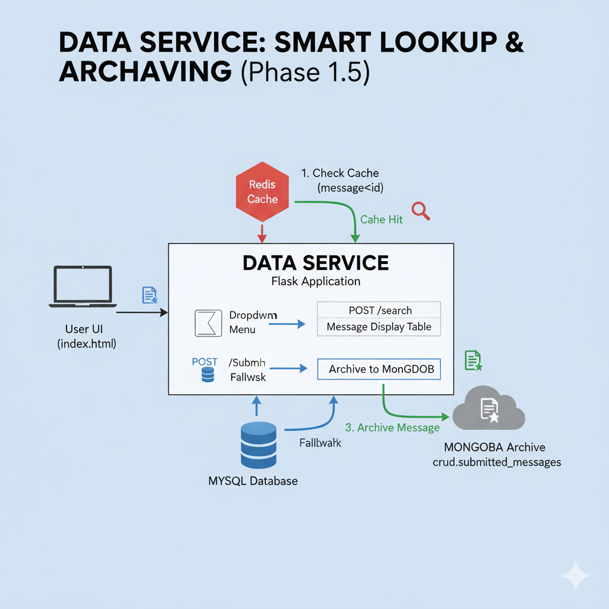
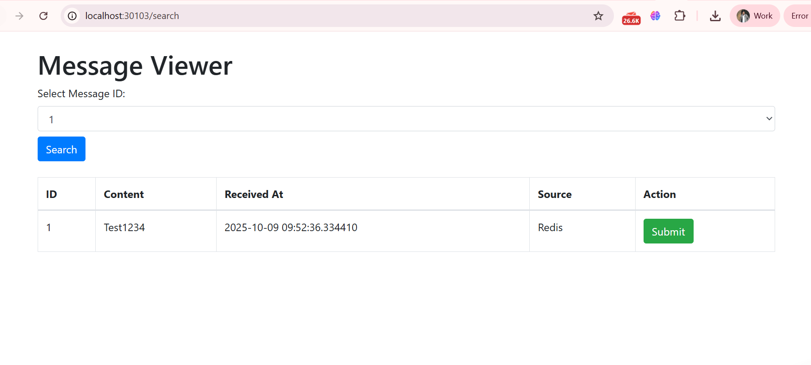

<h1 align="center" style="color:#16A085; border-bottom: 3px solid #16A085; padding-bottom: 10px;">
    🐍 Data Service: Smart Lookup and Archiving Microservice
</h1>

    This Flask application demonstrates <strong>intelligent data retrieval</strong> by prioritizing the high-speed <strong>Redis cache</strong>, ensuring durability with **MySQL**, and archiving data in **MongoDB**.

  

<h2>🎯 Purpose and Multi-Database Flow</h2>

    The Data Service acts as a final interactive viewer, empowering the user to validate the entire persistence path before archiving the message record.

<h3>Data Flow Summary</h3>
<table style="width:100%; border-collapse: collapse; margin-bottom: 20px;">
    <thead>
        <tr style="background-color: #f0f0f0;">
            <th style="padding: 10px; border: 1px solid #ddd;">Stage</th>
            <th style="padding: 10px; border: 1px solid #ddd;">Action</th>
            <th style="padding: 10px; border: 1px solid #ddd;">Confirmed</th>
        </tr>
    </thead>
    <tbody>
        <tr>
            <td style="padding: 10px; border: 1px solid #ddd;"><strong>Data Source</strong></td>
            <td style="padding: 10px; border: 1px solid #ddd;">Reads data first from <strong>Redis</strong>, then falls back to <strong>MySQL</strong>.</td>
            <td style="padding: 10px; border: 1px solid #ddd;">Demonstrates the <strong>Cache-Aside Pattern</strong> for performance.</td>
        </tr>
        <tr>
            <td style="padding: 10px; border: 1px solid #ddd;"><strong>UI Interaction</strong></td>
            <td style="padding: 10px; border: 1px solid #ddd;">Displays the message and its <strong>source of truth</strong> (Redis or MySQL).</td>
            <td style="padding: 10px; border: 1px solid #ddd;">Allows interactive validation of caching effectiveness.</td>
        </tr>
        <tr>
            <td style="padding: 10px; border: 1px solid #ddd;"><strong>Archiving</strong></td>
            <td style="padding: 10px; border: 1px solid #ddd;">Submits the final message record to <strong>MongoDB</strong>.</td>
            <td style="padding: 10px; border: 1px solid #ddd;">Proves the ability to forward data to a dedicated analytical store.</td>
        </tr>
    </tbody>
</table>

<h2>📁 Project Structure and File Responsibilities</h2>

    The service is highly modular, separating web logic from each specific database interaction.

<table style="width:100%; border-collapse: collapse; margin-bottom: 20px;">
    <thead>
        <tr style="background-color: #f0f0f0;">
            <th style="padding: 10px; border: 1px solid #ddd;">File</th>
            <th style="padding: 10px; border: 1px solid #ddd;">Purpose</th>
            <th style="padding: 10px; border: 1px solid #ddd;">Key Technologies</th>
        </tr>
    </thead>
    <tbody>
        <tr>
            <td style="padding: 10px; border: 1px solid #ddd;"><strong><code>app.py</code></strong></td>
            <td style="padding: 10px; border: 1px solid #ddd;"><strong>Central Controller:</strong> Defines the web routes, handles request flow, and manages session state (Flask).</td>
            <td style="padding: 10px; border: 1px solid #ddd;">Flask</td>
        </tr>
        <tr>
            <td style="padding: 10px; border: 1px solid #ddd;"><strong><code>redis_client.py</code></strong></td>
            <td style="padding: 10px; border: 1px solid #ddd;"><strong>Caching Layer:</strong> Handles <code>get</code> requests from the Redis server, using the specific key format (<code>message:&lt;id&gt;</code>).</td>
            <td style="padding: 10px; border: 1px solid #ddd;"><code>redis</code> (Python library)</td>
        </tr>
        <tr>
            <td style="padding: 10px; border: 1px solid #ddd;"><strong><code>mysql_client.py</code></strong></td>
            <td style="padding: 10px; border: 1px solid #ddd;"><strong>Persistence Layer:</strong> Fetches available IDs and full message details directly from the MySQL database.</td>
            <td style="padding: 10px; border: 1px solid #ddd;"><code>pymysql</code></td>
        </tr>
        <tr>
            <td style="padding: 10px; border: 1px solid #ddd;"><strong><code>mongo_client.py</code></strong></td>
            <td style="padding: 10px; border: 1px solid #ddd;"><strong>Archiving Layer:</strong> Connects to MongoDB and saves the final, submitted message record.</td>
            <td style="padding: 10px; border: 1px solid #ddd;"><code>pymongo</code></td>
        </tr>
        <tr>
            <td style="padding: 10px; border: 1px solid #ddd;"><strong><code>index.html</code></strong></td>
            <td style="padding: 10px; border: 1px solid #ddd;"><strong>User Interface:</strong> Provides the message ID selection dropdown, displays search results, and contains the "Archive" button.</td>
            <td style="padding: 10px; border: 1px solid #ddd;">HTML, Bootstrap</td>
        </tr>
    </tbody>
</table>

<h2>💡 Key Code Logic and Connectivity</h2>

<h3>1. The Cache-Aside Search Logic (Central to <code>app.py</code>)</h3>

The code prioritizes the fastest connection (Redis) and only executes the slower, more resource-intensive connection (MySQL) if a cache miss occurs.

<pre><code># 1. Attempt to retrieve data from Redis
message = get_message_from_redis(msg_id) 

if message:
    message["source"] = "Redis Cache"
    message["status"] = "Cache Hit"
else:
    # 2. Cache Miss: Fallback to MySQL
    message = get_message_by_id(msg_id)
    if message:
        message["source"] = "MySQL Database"
        message["status"] = "Cache Miss (Fallback)"
</code></pre>

<h3>2. Database Connectivity via Kubernetes DNS</h3>

All database clients use **Environment Variables** (set in the Kubernetes Deployment YAML) to locate services via their stable DNS names.

<table style="width:100%; border-collapse: collapse; margin-bottom: 20px;">
    <thead>
        <tr style="background-color: #f0f0f0;">
            <th style="padding: 10px; border: 1px solid #ddd;">Service</th>
            <th style="padding: 10px; border: 1px solid #ddd;">Connection Type</th>
            <th style="padding: 10px; border: 1px solid #ddd;">DNS Address Used</th>
        </tr>
    </thead>
    <tbody>
        <tr>
            <td style="padding: 10px; border: 1px solid #ddd;"><strong>MySQL</strong></td>
            <td style="padding: 10px; border: 1px solid #ddd;">Persistence/Source</td>
            <td style="padding: 10px; border: 1px solid #ddd;"><code>mysql.database.svc.cluster.local:3306</code></td>
        </tr>
        <tr>
            <td style="padding: 10px; border: 1px solid #ddd;"><strong>Redis</strong></td>
            <td style="padding: 10px; border: 1px solid #ddd;">Caching Layer</td>
            <td style="padding: 10px; border: 1px solid #ddd;"><code>redis.cache.svc.cluster.local:6379</code></td>
        </tr>
        <tr>
            <td style="padding: 10px; border: 1px solid #ddd;"><strong>MongoDB</strong></td>
            <td style="padding: 10px; border: 1px solid #ddd;">Archiving/Analytics</td>
            <td style="padding: 10px; border: 1px solid #ddd;"><code>mongodb.database.svc.cluster.local:27017</code></td>
        </tr>
    </tbody>
</table>

<h1 align="center" style="color:#2F80ED; border-bottom: 3px solid #2F80ED; padding-bottom: 10px;">
    ⚙️ Deploying the Data Service (Python/Flask)
</h1>

    This document explains the Kubernetes manifests used to deploy our Python/Flask microservice, connecting it to all previously established data services.

<h2>1. Kubernetes Manifests</h2>

    This deployment uses three resources: a **Namespace** for isolation, a **Deployment** for the container, and a **NodePort Service** for external web access.

<h3>A. Namespace (`data`)</h3>
<pre><code>apiVersion: v1
kind: Namespace
metadata:
  name: data
</code></pre>

<strong>Purpose:</strong> Creates the <code>data</code> namespace to logically group the Data Service, supporting better organization and security policies.

<h3>B. Deployment (`dataservice`)</h3>
<pre><code>apiVersion: apps/v1
kind: Deployment
metadata:
  name: dataservice
  namespace: data
spec:
  replicas: 1
  selector:
    matchLabels:
      app: dataservice
  template:
    metadata:
      labels:
        app: dataservice
    spec:
      containers:
        - name: dataservice
          image: praveen581348/dataservice:14
          ports:
            - containerPort: 8013
          env:
            - name: FLASK_ENV
              value: "production"
            <!--
            CRUCIAL: These environment variables provide the Python application
            with the stable Kubernetes DNS names for connection.
            These must be set for the service to connect to MySQL, Redis, and MongoDB.
            -->
            - name: MYSQL_HOST
              value: "mysql.database.svc.cluster.local"
            - name: REDIS_HOST
              value: "redis.cache.svc.cluster.local"
            - name: MONGO_HOST
              value: "mongodb.database.svc.cluster.local"
            - name: MYSQL_USER
              value: "receiveruser"
            - name: MYSQL_PASS
              value: "receiverpassword"
            - name: MYSQL_DB
              value: "crud"
            - name: FLASK_SECRET_KEY
              value: "A_SECURE_KEY_FOR_SESSIONS"
</code></pre>

    <strong>Purpose:</strong> Runs the Python/Flask application. It sets the internal container port (<code>8013</code>) and, critically, passes the **Kubernetes DNS addresses** to the Flask application via environment variables.

<h3>C. Service (`dataservice-service`)</h3>
<pre><code>apiVersion: v1
kind: Service
metadata:
  name: dataservice-service
  namespace: data
spec:
  selector:
    app: dataservice
  ports:
    - protocol: TCP
      port: 8013
      targetPort: 8013
      nodePort: 30103
  type: NodePort
</code></pre>

    <strong>Purpose:</strong> Exposes the web UI of the Data Service (Flask application). The <code>NodePort</code> type allows you to access the service from your local machine via <code>http://localhost:30103</code>.

<h2>2. Verification and Access</h2>

<h3>🚀 Applying the Manifests</h3>

    Save all three sections above into a single YAML file (e.g., <code>dataservice-k8s.yaml</code>) and apply it to the cluster:

<pre><code>kubectl apply -f dataservice-k8s.yaml</code></pre>

<h3>🔍 Verification Steps</h3>
<ol>
    <li>**Check Pod Status:** Ensure the Python application pod is running.
        <pre><code>kubectl get pods -n data</code></pre>
    </li>
    <li>**Check Logs:** Verify successful connection to all three databases.
        <pre><code>kubectl logs -f deployment/dataservice -n data</code></pre>
    </li>
    <li>**Access the UI:** Open the service dashboard in your browser. This URL will be used to test the Redis/MySQL fallback logic and the MongoDB archiving process.
        <pre><code>Access URL: http://localhost:30103</code></pre>
    </li>
</ol>

<h1 align="center" style="color:#16A085; border-bottom: 3px solid #16A085; padding-bottom: 10px;">
    ✅ Data Service: Final Validation and Archiving
</h1>

    This document confirms the successful operation of the <strong>Data Service</strong> (Python/Flask) and validates the complete, four-tier data flow: <strong>MySQL ➡️ Redis ➡️ Flask ➡️ MongoDB</strong>.

<h2>1. Validation Flow Summary</h2>

    The validation process confirms that the Python application correctly implements the **Cache-Aside Pattern** and archives the final record into the non-relational database.

<table style="width:100%; border-collapse: collapse; margin-bottom: 20px;">
    <thead>
        <tr style="background-color: #f0f0f0;">
            <th style="padding: 10px; border: 1px solid #ddd;">Step</th>
            <th style="padding: 10px; border: 1px solid #ddd;">System</th>
            <th style="padding: 10px; border: 1px solid #ddd;">Confirmed Action</th>
        </tr>
    </thead>
    <tbody>
        <tr>
            <td style="padding: 10px; border: 1px solid #ddd;"><strong>Search</strong></td>
            <td style="padding: 10px; border: 1px solid #ddd;">Data Service UI</td>
            <td style="padding: 10px; border: 1px solid #ddd;">Application implements **Cache-Aside**, checking Redis first, and falling back to MySQL if necessary.</td>
        </tr>
        <tr>
            <td style="padding: 10px; border: 1px solid #ddd;"><strong>Retrieve</strong></td>
            <td style="padding: 10px; border: 1px solid #ddd;">Python Flask</td>
            <td style="padding: 10px; border: 1px solid #ddd;">Full message details (`ID`, `Content`, `Received At`) are retrieved and displayed.</td>
        </tr>
        <tr>
            <td style="padding: 10px; border: 1px solid #ddd;"><strong>Archive</strong></td>
            <td style="padding: 10px; border: 1px solid #ddd;">MongoDB Pod</td>
            <td style="padding: 10px; border: 1px solid #ddd;">Record is inserted into the `crud.submitted_messages` collection for historical use.</td>
        </tr>
    </tbody>
</table>

<h2>2. Validation Log: Execution & Results</h2>

    The following logs prove the successful flow from database lookup to the final MongoDB archive.

<h3>A. UI Interaction (Search and Display)</h3>

    The user successfully searched for message ID 1 (which was previously cached in Redis or persisted in MySQL by the Receiver Service).

    

<h3>B. MongoDB Archive Verification</h3>

    This step confirms that clicking the **Submit** button successfully called the `mongo_client.py` and archived the data.

<pre><code># Action: Access the MongoDB Pod and Query Archive
kubectl exec -it &lt;mongodb-pod-name&gt; -n database -- mongosh

# Query the submitted_messages collection
crud> use crud
switched to db crud
crud> db.submitted_messages.find().pretty()
</code></pre>

<h4 style="color:#16A085;">Result: Archived Message Found</h4>
<pre><code>[
  {
    _id: ObjectId('68e7f4d4c4c6bd8779abeb11'),
    id: '2',
    content: 'Test1235',
    received_at: '2025-10-09 09:53:33.839439'
  }
]
</code></pre>

    Conclusion: The validation of the Data Service confirms the full tiered architecture is operational, from Kafka message flow to durable archiving.

  

