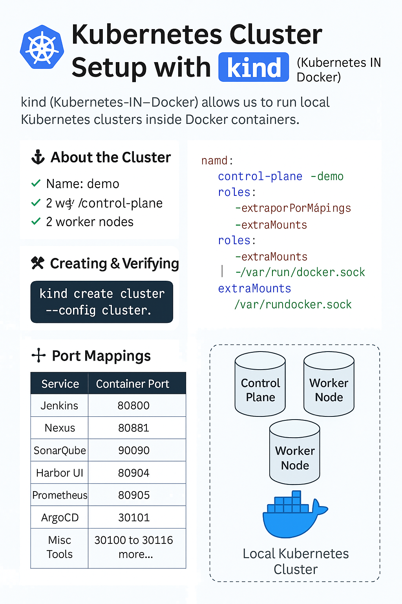

<h1>🚀 Setting Up Your Local Kubernetes Cluster with kind</h1>

This guide helps you set up a local Kubernetes cluster using <strong>kind</strong> (Kubernetes IN Docker). It's optimized for local development and CI environments and forms the foundation for Phase 1 of our project.

<h2>🔧 What is kind?</h2>

<strong>kind</strong> stands for Kubernetes IN Docker. It lets us run Kubernetes clusters in Docker containers, ideal for:

<ul>
  <li>🧪 Local testing and development</li>
  <li>📦 CI/CD pipelines and sandboxing</li>
  <li>🎓 Learning Kubernetes without a cloud setup</li>
</ul>
 

<h2>💻 Prerequisites for macOS</h2>
<ol>
  <li><strong>Install Docker Desktop:</strong> <a href="https://www.docker.com/products/docker-desktop" target="_blank">Download Docker</a></li>
  <li><strong>Install kind:</strong> <code>brew install kind</code></li>
  <li><strong>Install kubectl:</strong> <code>brew install kubectl</code></li>
</ol>

<h2>🛠️ cluster.yaml File</h2>

This configuration defines a cluster with 1 control-plane node and 2 worker nodes, and maps multiple container ports to host ports.

<pre><code>kind: Cluster
apiVersion: kind.x-k8s.io/v1alpha4
name: demo
nodes:
  - role: control-plane
    extraPortMappings:
      - containerPort: 30094
        hostPort: 30094
        protocol: TCP
      - containerPort: 30091
        hostPort: 30091
        protocol: TCP
      - containerPort: 30092
        hostPort: 30092
        protocol: TCP
      - containerPort: 30093
        hostPort: 30093
        protocol: TCP
      - containerPort: 30095
        hostPort: 30095
        protocol: TCP
      - containerPort: 30096
        hostPort: 30096
        protocol: TCP
      - containerPort: 30097
        hostPort: 30097
        protocol: TCP
      - containerPort: 30084
        hostPort: 30084
        protocol: TCP
      - containerPort: 30080
        hostPort: 30080
        protocol: TCP
      - containerPort: 30081
        hostPort: 30081
        protocol: TCP
      - containerPort: 30090
        hostPort: 30090
        protocol: TCP
      - containerPort: 30098
        hostPort: 30098
        protocol: TCP
      - containerPort: 30099
        protocol: TCP
      - containerPort: 30100
        hostPort: 30100
        protocol: TCP
      - containerPort: 30101
        hostPort: 30101
        protocol: TCP
      - containerPort: 30102
        hostPort: 30102
        protocol: TCP
      - containerPort: 30103
        hostPort: 30103
        protocol: TCP
      - containerPort: 30104
        hostPort: 30104
        protocol: TCP
      - containerPort: 30105
        hostPort: 30105
        protocol: TCP
      - containerPort: 30106
        hostPort: 30106
        protocol: TCP
      - containerPort: 30107
        hostPort: 30107
        protocol: TCP
      - containerPort: 30109
        hostPort: 30109
        protocol: TCP
      - containerPort: 30110
        hostPort: 30110
        protocol: TCP
      - containerPort: 30111
        hostPort: 30111
        protocol: TCP
      - containerPort: 30112
        hostPort: 30112
        protocol: TCP
      - containerPort: 30113
        hostPort: 30113
        protocol: TCP
      - containerPort: 30114
        hostPort: 30114
        protocol: TCP
      - containerPort: 30115
        hostPort: 30115
        protocol: TCP
      - containerPort: 30116
        hostPort: 30116
        protocol: TCP
    extraMounts:
      - hostPath: /var/run/docker.sock
        containerPath: /var/run/docker.sock

  - role: worker
    extraMounts:
      - hostPath: /var/run/docker.sock
        containerPath: /var/run/docker.sock

  - role: worker
    extraMounts:
      - hostPath: /var/run/docker.sock
        containerPath: /var/run/docker.sock
</code></pre>

<h2>🚀 Create the Cluster</h2>
<pre><code>kind create cluster --config cluster.yaml</code></pre>

This will create a cluster named <code>demo</code> with the specified configuration.

<h2>✅ Verify Cluster Creation</h2>
<ul>
  <li><code>kubectl get nodes</code> → Check nodes are Ready</li>
  <li><code>kubectl get pods -A</code> → View all running pods</li>
  <li><code>kubectl cluster-info</code> → View cluster access URLs</li>
</ul>

<h2>📦 Basic kind Commands</h2>
<table border="1" cellpadding="6" cellspacing="0">
<thead>
<tr><th>Task</th><th>Command</th><th>Purpose</th></tr>
</thead>
<tbody>
<tr><td>Create Cluster</td><td><code>kind create cluster --config cluster.yaml</code></td><td>Creates a cluster with specified config</td></tr>
<tr><td>Delete Cluster</td><td><code>kind delete cluster --name demo</code></td><td>Deletes the demo cluster</td></tr>
<tr><td>List Clusters</td><td><code>kind get clusters</code></td><td>Shows all existing kind clusters</td></tr>
<tr><td>Load Docker Image</td><td><code>kind load docker-image image-name:tag --name demo</code></td><td>Injects local Docker image into kind cluster</td></tr>
</tbody>
</table>

<h2>🧭 kubectl Context Management</h2>
<table border="1" cellpadding="6" cellspacing="0">
<thead>
<tr><th>Task</th><th>Command</th><th>Purpose</th></tr>
</thead>
<tbody>
<tr><td>View contexts</td><td><code>kubectl config get-contexts</code></td><td>Lists available kubeconfig contexts</td></tr>
<tr><td>Switch context</td><td><code>kubectl config use-context kind-demo</code></td><td>Switches to the kind demo context</td></tr>
<tr><td>Delete context</td><td><code>kubectl config delete-context kind-demo</code></td><td>Removes the context</td></tr>
<tr><td>Test connection</td><td><code>kubectl get nodes</code></td><td>Verifies connection to cluster</td></tr>
</tbody>
</table>

<strong>📘 Repository:</strong> <a href="https://github.com/praveen581348/cluster" target="_blank">https://github.com/praveen581348/cluster</a>

