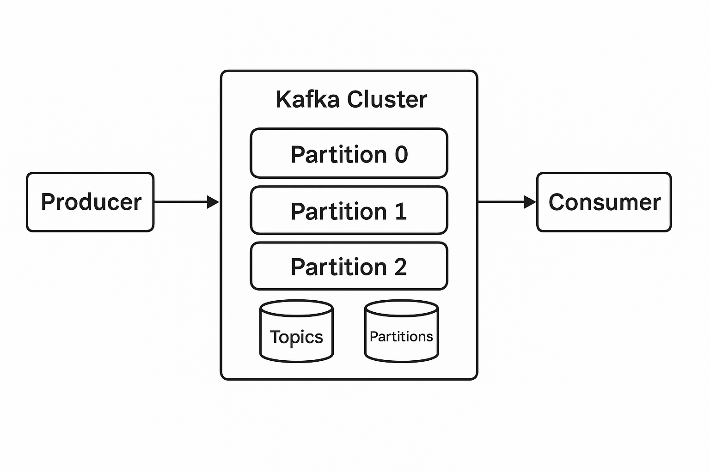
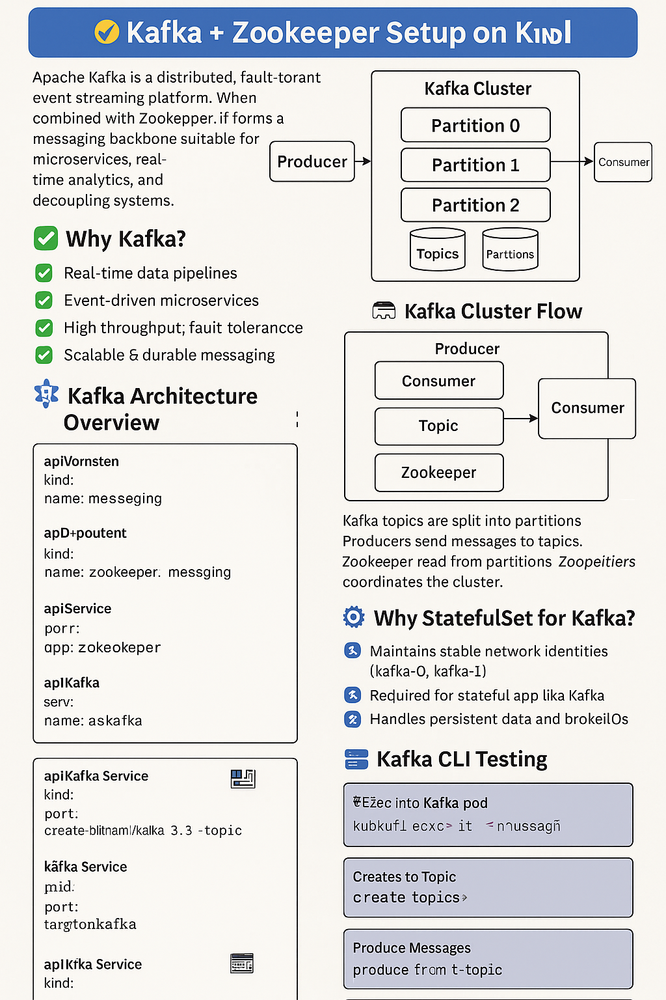
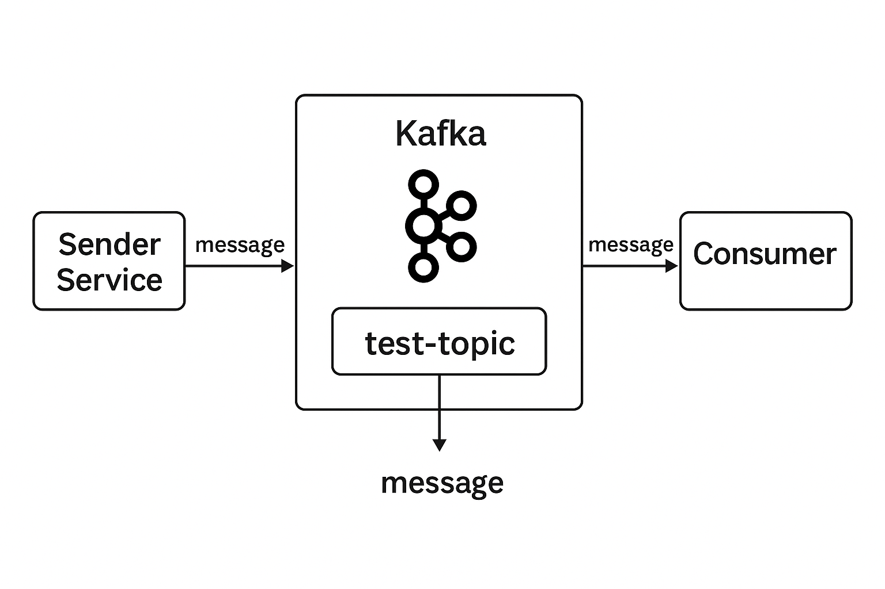

<h1>🛰️ Kafka + Zookeeper Setup on Kubernetes (kind)</h1>

  
  
  

Apache Kafka is a distributed, fault-tolerant event streaming platform. When combined with Zookeeper, it forms a robust messaging backbone suitable for microservices, real-time analytics, and decoupling systems.

<h2>📌 Why Kafka?</h2>
<ul>
  <li>✅ Real-time data pipelines</li>
  <li>✅ Event-driven microservices</li>
  <li>✅ High throughput, fault tolerance</li>
  <li>✅ Scalable & durable messaging</li>
</ul>

<h2>🧠 Key Concepts</h2>
<table border="1" cellpadding="6">
  <thead><tr><th>Term</th><th>Description</th></tr></thead>
  <tbody>
    <tr><td>Producer</td><td>Sends messages to Kafka</td></tr>
    <tr><td>Consumer</td><td>Reads messages from Kafka</td></tr>
    <tr><td>Topic</td><td>Named stream where records are sent</td></tr>
    <tr><td>Partition</td><td>Subdivision of a topic for parallelism</td></tr>
    <tr><td>Broker</td><td>Kafka server that holds partitions</td></tr>
    <tr><td>Zookeeper</td><td>Manages brokers, leader election</td></tr>
    <tr><td>Offset</td><td>Position of message within partition</td></tr>
  </tbody>
</table>

<h2>🧱 Kafka Architecture Overview</h2>
<pre>
+-----------+     +-------------------+     +------------+
| Producer  | --> |   Kafka Cluster   | --> | Consumer   |
+-----------+     |   Partitioned Log   |     +------------+
                  +-------------------+
</pre>

<h2>🗺️ Kafka Cluster Flow</h2>

Kafka topics are split into partitions. Producers send messages to topics, and consumers read from partitions. Zookeeper coordinates the cluster.

<h2>🧾 Kubernetes YAML: Kafka + Zookeeper (Updated)</h2>

<h3>📁 Namespace</h3>
<pre><code>apiVersion: v1
kind: Namespace
metadata:
  name: messaging
</code></pre>

<h3>📁 Zookeeper Deployment</h3>
<pre><code>apiVersion: apps/v1
kind: Deployment
metadata:
  name: zookeeper
  namespace: messaging
spec:
  replicas: 1
  selector:
    matchLabels:
      app: zookeeper
  template:
    metadata:
      labels:
        app: zookeeper
    spec:
      containers:
        - name: zookeeper
          image: confluentinc/cp-zookeeper:7.6.0
          ports:
            - containerPort: 2181
          env:
            - name: ZOOKEEPER_CLIENT_PORT
              value: "2181"
            - name: ZOOKEEPER_TICK_TIME
              value: "2000"
</code></pre>

<h3>📁 Zookeeper Service</h3>
<pre><code>apiVersion: v1
kind: Service
metadata:
  name: zookeeper
  namespace: messaging
spec:
  ports:
    - port: 2181
      targetPort: 2181
  selector:
    app: zookeeper
</code></pre>

<h3>📁 Kafka StatefulSet</h3>
<pre><code>apiVersion: apps/v1
kind: StatefulSet
metadata:
  name: kafka
  namespace: messaging
spec:
  serviceName: kafka
  replicas: 1
  selector:
    matchLabels:
      app: kafka
  template:
    metadata:
      labels:
        app: kafka
    spec:
      containers:
        - name: kafka
          image: confluentinc/cp-kafka:7.6.0
          ports:
            - containerPort: 9092
          env:
            - name: HOSTNAME
              valueFrom:
                fieldRef:
                  fieldPath: metadata.name
            - name: KAFKA_BROKER_ID_COMMAND
              value: "echo ${HOSTNAME##*-}"
            - name: KAFKA_ZOOKEEPER_CONNECT
              value: zookeeper.messaging.svc.cluster.local:2181
            - name: KAFKA_LISTENERS
              value: "PLAINTEXT://:9092"
            - name: KAFKA_ADVERTISED_LISTENERS
              value: "PLAINTEXT://$(HOSTNAME).kafka.messaging.svc.cluster.local:9092"
            - name: KAFKA_OFFSETS_TOPIC_REPLICATION_FACTOR
              value: "1"
            - name: KAFKA_LOG_DIRS
              value: "/var/lib/kafka/data"
            - name: KAFKA_INTER_BROKER_LISTENER_NAME
              value: PLAINTEXT
          volumeMounts:
            - name: data
              mountPath: /var/lib/kafka/data
      volumeClaimTemplates:
        - metadata:
            name: data
          spec:
            accessModes: ["ReadWriteOnce"]
            resources:
              requests:
                storage: 1Gi
</code></pre>

<h3>📁 Kafka Service (Headless)</h3>
<pre><code>apiVersion: v1
kind: Service
metadata:
  name: kafka
  namespace: messaging
spec:
  clusterIP: None
  ports:
    - port: 9092
      targetPort: 9092
  selector:
    app: kafka
</code></pre>

<h2>❓ Why StatefulSet for Kafka?</h2>
<ul>
  <li>⚙️ Maintains stable network identities (kafka-0, kafka-1)</li>
  <li>📌 Required for stateful apps like Kafka</li>
  <li>🔁 Handles persistent data and broker IDs</li>
</ul>

<h2>🧪 Kafka CLI Testing (Updated)</h2>

<pre><code># Exec into Kafka pod
kubectl exec -it -n messaging kafka-0 -- bash
</code></pre>

<ul>
  <li><strong>Create Topic:</strong></li>
<pre><code>/usr/bin/kafka-topics --create \
 --bootstrap-server localhost:9092 \
 --replication-factor 1 \
 --partitions 1 \
 --topic test-topic
</code></pre>

  <li><strong>List Topics:</strong></li>
<pre><code>/usr/bin/kafka-topics --list --bootstrap-server localhost:9092
</code></pre>

  <li><strong>Produce Messages:</strong></li>
<pre><code>/usr/bin/kafka-console-producer --bootstrap-server localhost:9092 --topic test-topic
</code></pre>

  <li><strong>Consume Messages:</strong></li>
<pre><code>/usr/bin/kafka-console-consumer --bootstrap-server localhost:9092 --topic test-topic --from-beginning
</code></pre>

  <li><strong>Delete Topic:</strong></li>
<pre><code>/usr/bin/kafka-topics --delete --bootstrap-server localhost:9092 --topic test-topic
</code></pre>
</ul>

<h2>✅ Summary</h2>
<table border="1" cellpadding="6">
<thead><tr><th>Component</th><th>Description</th></tr></thead>
<tbody>
<tr><td>Kafka</td><td>Distributed messaging backbone</td></tr>
<tr><td>Zookeeper</td><td>Coordinates Kafka brokers</td></tr>
<tr><td>Topic</td><td>Logical channel for messages</td></tr>
<tr><td>Partition</td><td>Parallel sub-streams in a topic</td></tr>
<tr><td>StatefulSet</td><td>Maintains broker state & ID</td></tr>
<tr><td>CLI</td><td>Kafka shell commands for testing</td></tr>
</tbody>
</table>

<h2>📚 Resources</h2>
<ol>
  <li>📦 <a href="https://github.com/praveen581348/project_allinone" target="_blank">GitHub: project_allinone</a></li>
    <li>🔁 <a href="https://github.com/praveen581348/project_allinone/blob/master/application_flow.md" target="_blank">Application Flow (GitHub)</a></li>
  <li>📋 <a href="https://github.com/praveen581348/project_allinone/blob/master/SDLC-and-DevOps-Overview.md" target="_blank">SDLC & DevOps Overview</a></li>
  
  <li>🚀 <a href="https://github.com/praveen581348/project_allinone/blob/master/why_docker_kubernetes_kind.md" target="_blank">Why Docker, Kubernetes & kind?</a></li>
  <li>🔧 <a href="https://github.com/praveen581348/project_allinone/blob/master/why_docker_kubernetes_kind.md" target="_blank">Setup Kind Cluster</a></li>
  <li>🌐 <a href="https://github.com/praveen581348/cluster" target="_blank">Cluster Repository</a></li>
  
  <li>🐳 <a href="https://chatgpt.com/share/6857d18a-a8c0-8001-9c67-850a90e9ddbe" target="_blank">Learn Docker (ChatGPT)</a></li>
  
  <li>☸️ <a href="https://chatgpt.com/share/6857e648-5de0-8001-ab14-7897f0aa5989" target="_blank">Learn Kubernetes (ChatGPT)</a></li>
  
  <li>🧪 <a href="https://chatgpt.com/share/6857e7f1-2d24-8001-88c5-41d0bf8c0c51" target="_blank">Learn kind Cluster (ChatGPT)</a></li>
  
  <li>🛠️ <a href="https://github.com/praveen581348/project_allinone/blob/master/why_springboot_maven.md" target="_blank">Why Spring Boot + Maven?</a></li>
  <li>🌱 <a href="https://chatgpt.com/share/685854c4-f9b4-8001-a16d-bab5320f29d5" target="_blank">Spring Boot Notes & Concepts (ChatGPT)</a></li>
  <li>📘 <a href="https://chatgpt.com/share/6859922a-e6f4-8001-864e-ba59b47ad706" target="_blank">Maven Notes (ChatGPT)</a></li>
  
  <li>📡 <a href="https://github.com/praveen581348/project_allinone/blob/master/setup_kafka_zookpeer.md" target="_blank">Setup Kafka & ZooKeeper (GitHub)</a></li>
  <li>📄 <a href="https://chatgpt.com/share/685d3b2e-485c-8001-bc5c-8c3702594e35" target="_blank">Kafka & ZooKeeper Concepts & Architecture (ChatGPT)</a></li>
  <li>📂 <a href="https://github.com/praveen581348/kafka_zookeeper" target="_blank">Kafka & ZooKeeper Repository</a></li>
</ol>