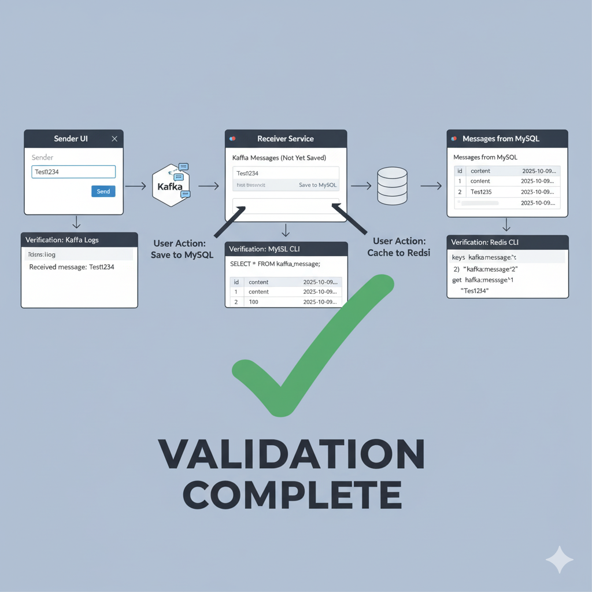
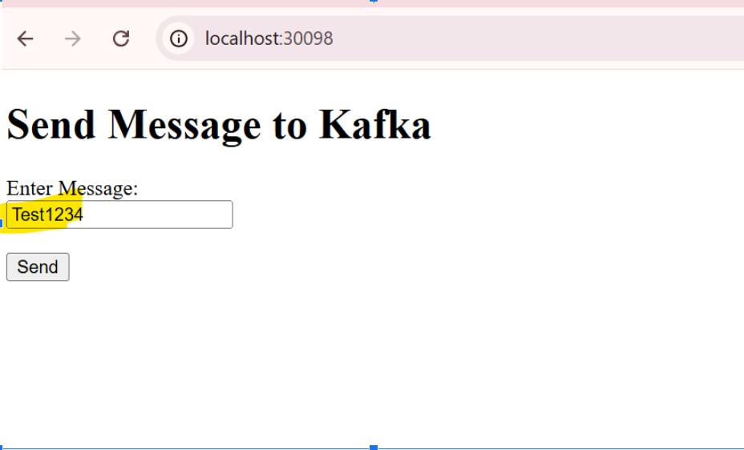
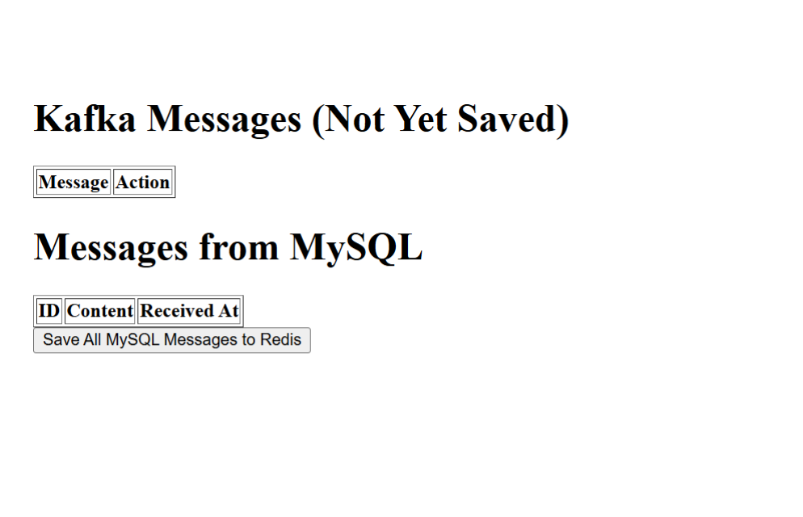
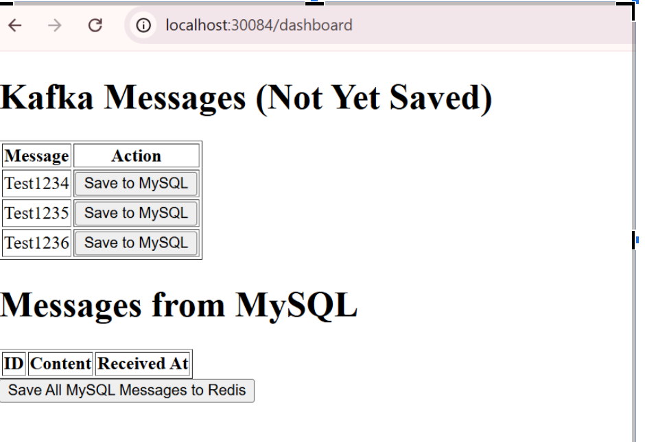
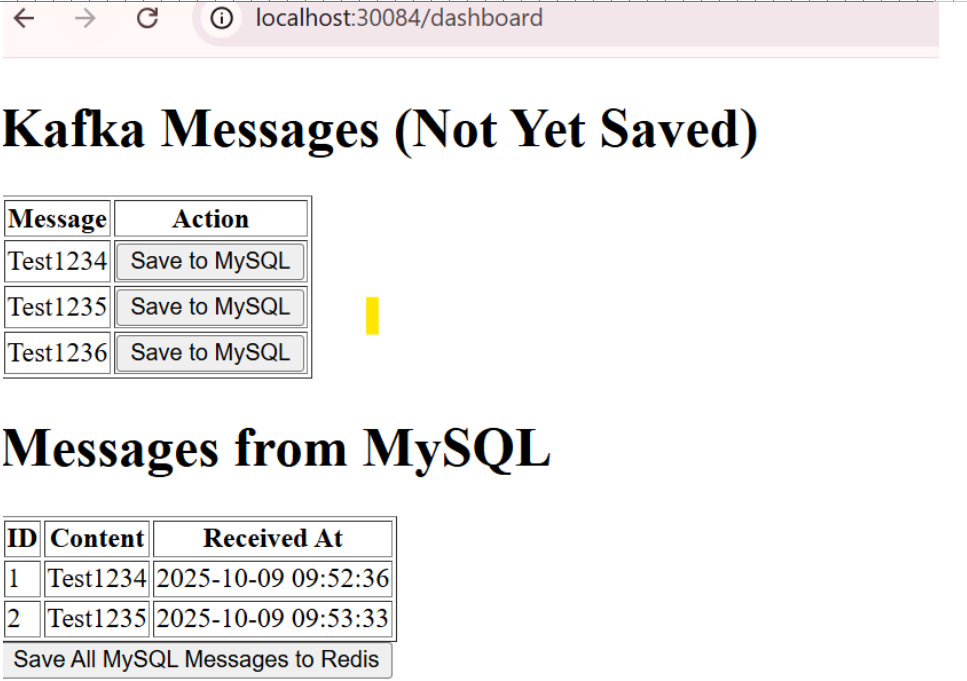

<h1 align="center" style="color:#2F80ED; border-bottom: 3px solid #2F80ED; padding-bottom: 10px;">
    ✅ Receiver Service: Complete Validation Guide
</h1>

    This document confirms the successful deployment and integration of the <strong>Receiver Service</strong>, proving the end-to-end data flow: <strong>Sender ➡️ Kafka ➡️ Receiver ➡️ MySQL ➡️ Redis</strong>.

  

<h2>1. Core Functionality and Architecture</h2>

    The Receiver Service implements a user-controlled data flow, separating message consumption (Kafka) from persistence (MySQL) and caching (Redis).

<table style="width:100%; border-collapse: collapse; margin-bottom: 20px;">
    <thead>
        <tr style="background-color: #f0f0f0;">
            <th style="padding: 10px; border: 1px solid #ddd;">Component</th>
            <th style="padding: 10px; border: 1px solid #ddd;">Technology</th>
            <th style="padding: 10px; border: 1px solid #ddd;">Role</th>
        </tr>
    </thead>
    <tbody>
        <tr>
            <td style="padding: 10px; border: 1px solid #ddd;"><strong>Kafka Listener</strong></td>
            <td style="padding: 10px; border: 1px solid #ddd;">Spring Kafka</td>
            <td style="padding: 10px; border: 1px solid #ddd;">Consumes messages and holds them <strong>in-memory</strong>.</td>
        </tr>
        <tr>
            <td style="padding: 10px; border: 1px solid #ddd;"><strong>Persistence</strong></td>
            <td style="padding: 10px; border: 1px solid #ddd;">Spring Data JPA / MySQL</td>
            <td style="padding: 10px; border: 1px solid #ddd;">Stores messages upon user request (the authoritative system of record).</td>
        </tr>
        <tr>
            <td style="padding: 10px; border: 1px solid #ddd;"><strong>Caching</strong></td>
            <td style="padding: 10px; border: 1px solid #ddd;">Spring Data Redis</td>
            <td style="padding: 10px; border: 1px solid #ddd;">Caches MySQL data for fast reads (Key format: <code>message:&lt;id&gt;</code>).</td>
        </tr>
    </tbody>
</table>

<h2>2. End-to-End Validation Steps</h2>

    This section confirms the successful flow of data using your documented inputs and outputs from the Kubernetes pods and the dashboard UI (<code>localhost:30084/messages</code>).

<h3>A. Step 1: Kafka Consumption (UI ➡️ In-Memory)</h3>

    Messages produced by the <strong>Sender Service</strong> are successfully consumed by the <strong>Receiver Service</strong> and displayed on the dashboard's first table.

<table style="width:100%; border-collapse: collapse; margin-bottom: 20px;">
    <thead>
        <tr style="background-color: #f2f2f2;">
            <th style="padding: 10px; border: 1px solid #ddd;">Action</th>
            <th style="padding: 10px; border: 1px solid #ddd;">Tool/System</th>
            <th style="padding: 10px; border: 1px solid #ddd;">Result Confirmed</th>
        </tr>
    </thead>
    <tbody>
        <tr>
            <td style="padding: 10px; border: 1px solid #ddd;">Produce Messages (e.g., Test1234, Test1235)</td>
            <td style="padding: 10px; border: 1px solid #ddd;">Sender Service UI</td>
            <td style="padding: 10px; border: 1px solid #ddd;">Messages appear in the <strong>"Kafka Messages (Not Yet Saved)"</strong> table.</td>
        </tr>
        <tr>
            <td style="padding: 10px; border: 1px solid #ddd;">Confirm Consumption</td>
            <td style="padding: 10px; border: 1px solid #ddd;">Receiver Service Logs</td>
            <td style="padding: 10px; border: 1px solid #ddd;">Logs show: <code>Received Kafka message: Test1234</code>.</td>
        </tr>
    </tbody>
</table>

<h3>B. Step 2: Persistence (In-Memory ➡️ MySQL)</h3>

    Clicking the action button saves the messages to the MySQL database, assigning them unique primary keys (IDs).

<pre><code># User Action
Click "Save All Kafka Messages to MySQL"

# Database Verification (Log Output)
mysql> SELECT id, content, received_at FROM kafka_message;
+----+----------+----------------------------+
| id | content  | received_at                |
+----+----------+----------------------------+
|  1 | Test1234 | 2025-10-09 09:52:36.334410 |
|  2 | Test1235 | 2025-10-09 09:53:33.839439 |
+----+----------+----------------------------+
</code></pre>

Result:

<ul>
    <li>The dashboard's **"Kafka Messages"** table is cleared.</li>
    <li>The data appears in the **"Messages from MySQL"** table, confirmed by the assigned auto-incremented `ID` and `received_at` timestamp.</li>
</ul>

<h3>C. Step 3: Caching (MySQL ➡️ Redis)</h3>

    This step validates the caching flow, where the persistence layer's data is copied to the high-speed Redis layer.

<pre><code># User Action
Click "Save All MySQL Messages to Redis"

# Redis CLI Verification
kubectl exec -it &lt;redis-pod-name&gt; -n cache -- redis-cli

# Verify Keys (ID 1 and 2 from MySQL)
> keys kafka:message:*
1) "kafka:message:2"
2) "kafka:message:1"

# Verify Content for ID 1
> get kafka:message:1
"Test1234"
</code></pre>

Conclusion:

    The validation confirms that Redis successfully received and stored the data, completing the full three-tiered data flow: **Messaging (Kafka) $\rightarrow$ Persistence (MySQL) $\rightarrow$ Caching (Redis).**

  
  
  
  
  
  

