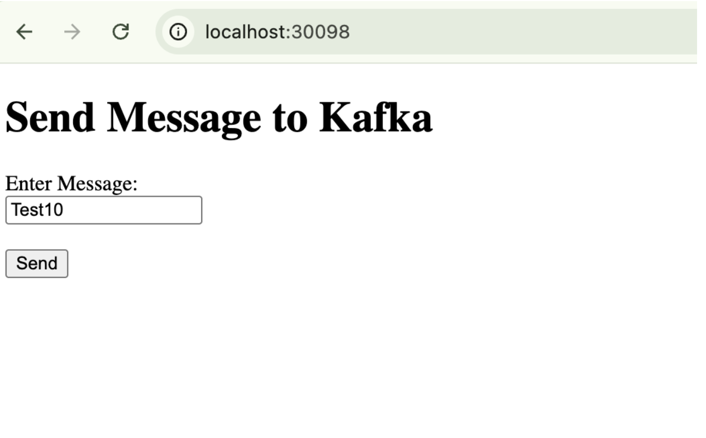
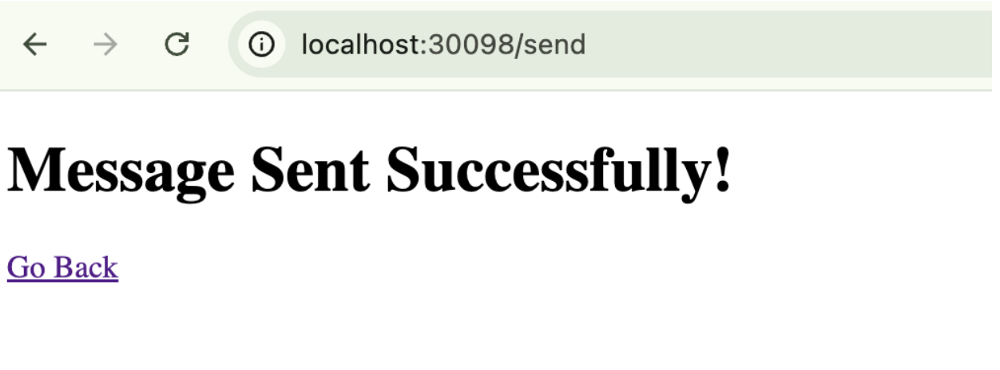
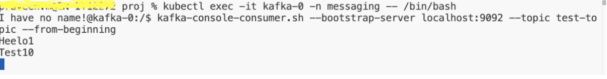

<!-- BEGIN HTML --> 
<h1>✅ Verify SenderService Integration with Kafka</h1> 

This guide walks you through validating the integration between your Spring Boot SenderService and the Kafka pod inside a Kubernetes (kind) cluster.
 
 
<h2>🎯 Goal</h2> 
<ul> 
<li>Send a message using the SenderService frontend (HTML form)</li>
 <li>Consume the message using Kafka CLI from inside the Kafka pod</li> 
 <li>Ensure end-to-end connectivity between the web UI and Kafka topic <code>test-topic</code></li> </ul> 
 
 
 <h2>🖼️ Screenshots</h2> 
 <ul> <li><strong>SenderService UI:</strong> 
 <code>http://localhost:30098</code>
 </li> 
 <li><strong>Confirmation Page:</strong> Message sent successfully</li>
  <li><strong>Kafka CLI Output:</strong> Received message from topic</li> </ul> 

  

  
  
  

  
 
  <h2>📍 Step-by-Step Verification</h2> 
  <h3>1️⃣ Access SenderService UI</h3> 
  
Open the following URL in your browser:
 
  <pre><code>http://localhost:30098</code></pre> 
  
You should see a simple message input form and a "Send" button.
 
  <h3>2️⃣ Submit a Message</h3> 
  
Type a test message, for example:
 
  <pre><code>Hello Kafka!</code></pre> 
  
Click the <strong>Send</strong> button. SenderService sends this message to Kafka on topic <code>test-topic</code>.
 <h3>3️⃣ Open Kafka Pod Shell</h3> 
Run the following command in your terminal:
 
  <pre><code>kubectl exec -it kafka-0 -n messaging -- /bin/bash</code></pre> 
  
You should see a prompt like:
 <pre>
  <code>I have no name!@kafka-0:/$</code></pre>
   <h3>4️⃣ Consume Messages from Kafka Topic</h3> 
   
Inside the Kafka pod shell, run:
 
   <pre><code>kafka-console-consumer.sh --bootstrap-server localhost:9092 --topic test-topic --from-beginning</code></pre> 
This will read all messages from the beginning of the topic.
 
   
<strong>Expected Output:</strong>
 
   <pre><code>Hello Kafka!</code></pre> 
 
   <h2>🧠 Behind the Scenes</h2>
    <table border="1" cellpadding="6"> 
    <thead><tr><th>Component</th><th>Role</th></tr></thead> <tbody> <tr><td>SenderService</td><td>Spring Boot microservice acting as Kafka producer</td></tr> <tr><td>Kafka Pod</td><td>Kafka broker managed by StatefulSet</td></tr> <tr><td>Zookeeper Pod</td><td>Coordinates Kafka brokers</td></tr> <tr><td>Kafka Topic</td><td><code>test-topic</code>, used to transport messages</td></tr> <tr><td>Kafka CLI Tool</td><td>Used to consume messages from Kafka</td></tr> </tbody> </table> 
 <h2>📋 Quick Summary Table</h2> <table border="1" cellpadding="6"> <thead><tr><th>Step</th><th>Description</th><th>Command / URL</th></tr></thead> <tbody> <tr><td>1</td><td>Access Sender UI</td><td><code>http://localhost:30098</code></td></tr> <tr><td>2</td><td>Submit a message</td><td>Use form input and click Send</td></tr> <tr><td>3</td><td>Enter Kafka Pod</td><td><code>kubectl exec -it kafka-0 -n messaging -- /bin/bash</code></td></tr> <tr><td>4</td><td>Start Kafka Consumer</td><td><code>kafka-console-consumer.sh ...</code></td></tr> <tr><td>5</td><td>See message in terminal</td><td><code>Hello Kafka!</code></td></tr> </tbody> </table> 
    
 
    <h2>🧪 Extra Tips</h2> <ul> <li>Press <code>Ctrl + C</code> to exit the Kafka consumer</li> <li>Type <code>exit</code> to leave the Kafka pod shell</li> <li>Use <code>kubectl logs -n messaging kafka-0</code> to view Kafka logs</li> </ul> 

    <h2>📚 Related Resources</h2> <ul> <li>📘 <a href="https://github.com/praveen581348/project_allinone/blob/master/setup_kafka_zookpeer.md" target="_blank">Kafka + Zookeeper Setup</a></li> <li>🌼 <a href="https://github.com/praveen581348/project_allinone/blob/master/sendservice_overview.md" target="_blank">SenderService Spring Boot App</a></li> </ul> 

    <h2>📚 Resources</h2>
<ol>
  <!-- GitHub Repos & Overviews -->
  <li>📦 <a href="https://github.com/praveen581348/project_allinone" target="_blank">GitHub: project_allinone</a></li>
   <li>🔁 <a href="https://github.com/praveen581348/project_allinone/blob/master/application_flow.md" target="_blank">Application Flow (GitHub)</a></li>
  <li>📋 <a href="https://github.com/praveen581348/project_allinone/blob/master/SDLC-and-DevOps-Overview.md" target="_blank">SDLC & DevOps Overview</a></li>
  
  <!-- Docker, Kubernetes, kind -->
  <li>🚀 <a href="https://github.com/praveen581348/project_allinone/blob/master/why_docker_kubernetes_kind.md" target="_blank">Why Docker, Kubernetes & kind?</a></li>
  <li>🔧 <a href="https://github.com/praveen581348/project_allinone/blob/master/why_docker_kubernetes_kind.md" target="_blank">Setup Kind Cluster</a></li>
  <li>🌐 <a href="https://github.com/praveen581348/cluster" target="_blank">Cluster Repository</a></li>
  
  <!-- Docker -->
  <li>🐳 <a href="https://chatgpt.com/share/6857d18a-a8c0-8001-9c67-850a90e9ddbe" target="_blank">Learn Docker (ChatGPT)</a></li>
  
  <!-- Kubernetes -->
  <li>☸️ <a href="https://chatgpt.com/share/6857e648-5de0-8001-ab14-7897f0aa5989" target="_blank">Learn Kubernetes (ChatGPT)</a></li>
  
  <!-- kind -->
  <li>🧪 <a href="https://chatgpt.com/share/6857e7f1-2d24-8001-88c5-41d0bf8c0c51" target="_blank">Learn kind Cluster (ChatGPT)</a></li>
  
  <!-- Spring Boot + Maven -->
  <li>🛠️ <a href="https://github.com/praveen581348/project_allinone/blob/master/why_springboot_maven.md" target="_blank">Why Spring Boot + Maven?</a></li>
  <li>🌱 <a href="https://chatgpt.com/share/685854c4-f9b4-8001-a16d-bab5320f29d5" target="_blank">Spring Boot Notes & Concepts (ChatGPT)</a></li>
  <li>📘 <a href="https://chatgpt.com/share/6859922a-e6f4-8001-864e-ba59b47ad706" target="_blank">Maven Notes (ChatGPT)</a></li>
  
  <!-- Kafka + ZooKeeper -->
  <li>📡 <a href="https://github.com/praveen581348/project_allinone/blob/master/setup_kafka_zookpeer.md" target="_blank">Setup Kafka & ZooKeeper (GitHub)</a></li>
  <li>📄 <a href="https://chatgpt.com/share/685d3b2e-485c-8001-bc5c-8c3702594e35" target="_blank">Kafka & ZooKeeper Concepts & Architecture (ChatGPT)</a></li>
  <li>📂 <a href="https://github.com/praveen581348/kafka_zookeeper" target="_blank">Kafka & ZooKeeper Repository</a></li>

   <!-- SenderService -->
   <li>🚀 <a href="https://github.com/praveen581348/project_allinone/blob/master/create_senderservice.md" target="_blank">Create SenderService – Spring Boot Kafka Producer</a></li>
   <li>📁 <a href="https://github.com/praveen581348/senderservice" target="_blank">SenderService Git Repository</a></li>
    <li>📦 <a href="https://github.com/praveen581348/project_allinone/blob/master/run_senderservice_as_pod.md" target="_blank">Run SenderService as a Pod (Kubernetes Deployment Guide)</a></li>
    <li>✅ <a href="https://github.com/praveen581348/project_allinone/blob/master/verify_senderservice_kafka.md" target="_blank">Verify SenderService Producing to Kafka</a></li>

</ol>

