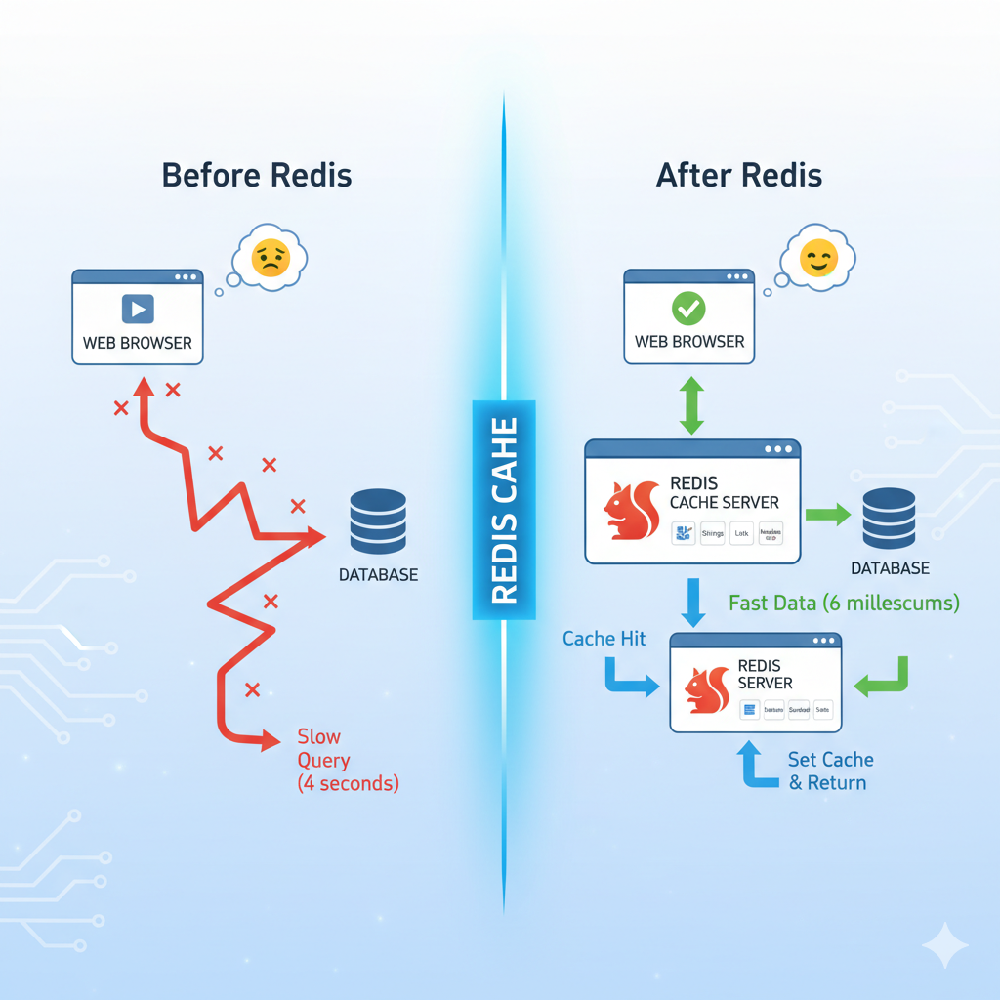

  

  

<h1 align="center" style="color:#DC3545; border-bottom: 2px solid #ddd; padding-bottom: 10px;">
    🖼️ Visual Explanation: Redis Caching (Cache-Aside Pattern)
</h1>

    This diagram illustrates how inserting Redis as an in-memory cache drastically improves application performance by optimizing the data retrieval path.

<h2>📉 1. Before Redis (The Problem)</h2>

    In the traditional setup, every user request from the **Web Browser** must execute a slow and direct query against the **Database** (which is disk-based).

<ul>
    <li>High Latency: The response path is long, often taking several seconds (e.g., **"Slow Query (4 seconds)"**).</li>
    <li>Database Strain: The primary database handles 100% of all read traffic, leading to scalability bottlenecks and poor user experience (😫).</li>
</ul>

<h2>🚀 2. After Redis (The Solution)</h2>

    The system introduces the **Redis Cache Server** as the first point of contact for data reads, minimizing interaction with the slow database.

<h3>Scenario A: Cache Hit (The Fast Path) ✨</h3>

This is the goal for repeated data access.

<ul>
    <li>Check Redis: The server checks Redis first.</li>
    <li>Instant Return: Data is found in Redis's fast RAM (**Cache Hit**) and returned immediately to the browser.</li>
    <li>Performance: Response time is sub-millisecond (e.g., **"Fast Data (6 milliseconds)"**), resulting in a happy user (😊).</li>
</ul>

<h3>Scenario B: Cache Miss (The Update Path) 🔄</h3>

This occurs when data is requested for the first time or after it expires.

<ul>
    <li>Query Database: Redis reports a miss, and the application queries the slower Database.</li>
    <li>Set Cache: The data retrieved from the database is used to perform a **"Set Cache & Return"** operation, storing the data in Redis so that the next request becomes a Cache Hit.</li>
</ul>

<h3 align="center" style="color:#28a745;">
    Summary: Redis acts as a high-speed shield, reducing latency and protecting the core database.
</h3>

<h1 align="center" style="color:#DC3545; border-bottom: 3px solid #DC3545; padding-bottom: 10px;">
    🚀 Redis: Comprehensive Setup and Usage Notes
</h1>

    A detailed guide on what Redis is, how its in-memory architecture works, setup instructions, and practical code examples across multiple programming languages.

<h2> What is Redis?</h2>

    <strong>Redis (REmote DIctionary Server)</strong> is an **open-source, in-memory data structure store**. It serves primarily as a **database**, **cache**, and **message broker**.

<h3>Key Features</h3>
<table style="width:100%; border-collapse: collapse; margin-bottom: 20px;">
    <thead>
        <tr style="background-color: #f0f0f0;">
            <th style="padding: 10px; border: 1px solid #ddd;">Feature</th>
            <th style="padding: 10px; border: 1px solid #ddd;">Description</th>
        </tr>
    </thead>
    <tbody>
        <tr>
            <td style="padding: 10px; border: 1px solid #ddd;"><strong>Data Model</strong></td>
            <td style="padding: 10px; border: 1px solid #ddd;">A <strong>key-value store</strong> (NoSQL). Stores a unique key associated with a value.</td>
        </tr>
        <tr>
            <td style="padding: 10px; border: 1px solid #ddd;"><strong>Storage Location</strong></td>
            <td style="padding: 10px; border: 1px solid #ddd;"><strong>In-memory (RAM)</strong>. This delivers unparalleled speed, achieving sub-millisecond response times.</td>
        </tr>
        <tr>
            <td style="padding: 10px; border: 1px solid #ddd;"><strong>Data Structures</strong></td>
            <td style="padding: 10px; border: 1px solid #ddd;">Supports Strings, **Lists**, **Sets**, **Sorted Sets**, **Hashes**, Bitmaps, and HyperLogLogs.</td>
        </tr>
        <tr>
            <td style="padding: 10px; border: 1px solid #ddd;"><strong>Use Cases</strong></td>
            <td style="padding: 10px; border: 1px solid #ddd;">Caching, Session Storage, Message Queues (Pub/Sub), Leaderboards/Counting, and Real-time Analytics.</td>
        </tr>
    </tbody>
</table>

<h2> How Redis Works</h2>

    Redis's speed stems from its **in-memory architecture** and **single-threaded nature**, which minimizes context switching overhead.

<h3>Persistence and High Availability</h3>
<ul>
    <li><strong>In-Memory Operation:</strong> All operations are performed on data stored in the main memory (RAM).</li>
    <li><strong>Persistence (Data Safety):</strong>
        <ul>
            <li>**RDB (Snapshot):** Periodically dumps the entire dataset to a compressed binary file on disk.</li>
            <li>**AOF (Append-Only File):** Logs every write operation to disk, which can be replayed to rebuild the dataset.</li>
        </ul>
    </li>
    <li><strong>High Availability & Scalability:</strong>
        <ul>
            <li>**Replication:** Master/Replica architecture for data redundancy and read scaling.</li>
            <li>**Redis Sentinel:** Provides monitoring and **automatic failover** for high availability.</li>
            <li>**Redis Cluster:** Provides automatic sharding (data partitioning) for large-scale deployments.</li>
        </ul>
    </li>
</ul>

<h2> How to Set Up Redis</h2>

    The easiest setup methods involve package managers or Docker. Redis typically runs on the default port **6379**.

<h3>Setup Methods</h3>

<strong>Method 1: Using Homebrew (macOS)</strong>

<pre style="background-color: #eee; padding: 10px; border-radius: 5px;"><code>brew install redis
brew services start redis</code></pre>

<strong>Method 2: Using Docker (Recommended for cross-platform)</strong>

<pre style="background-color: #eee; padding: 10px; border-radius: 5px;"><code>docker run --name my-redis -p 6379:6379 -d redis</code></pre>

<h3>Basic Verification (CLI)</h3>

Use the <code>redis-cli</code> to interact directly with the server.

<pre style="background-color: #eee; padding: 10px; border-radius: 5px;"><code>redis-cli
127.0.0.1:6379> PING
PONG
127.0.0.1:6379> SET mykey "HelloRedis"
OK
127.0.0.1:6379> GET mykey
"HelloRedis"</code></pre>

<h2>Using Redis with Programming Languages</h2>

Redis is compatible with virtually every major programming language through dedicated client libraries.

<h3>1. Python (using <code>redis-py</code>)</h3>
<pre style="background-color: #272822; color: #f8f8f2; padding: 15px; border-radius: 5px; overflow-x: auto;">
<code style="white-space: pre;"># Installation
pip install redis

# Example Code
import redis
r = redis.Redis(decode_responses=True)

# 1. SET and GET a simple string
r.set('name', 'Alice')
name = r.get('name') 
# Output: Name: Alice

# 2. Use a List (RPUSH adds elements to the right/tail)
r.rpush('mylist', 'item1', 'item2') 
list_items = r.lrange('mylist', 0, -1) 
# Output: List items: ['item1', 'item2']
</code></pre>

<h3>2. Java (using <code>Jedis</code>)</h3>
<pre style="background-color: #272822; color: #f8f8f2; padding: 15px; border-radius: 5px; overflow-x: auto;">
<code style="white-space: pre;">// Setup (Maven Dependency)
&lt;dependency&gt;
    &lt;groupId&gt;redis.clients&lt;/groupId&gt;
    &lt;artifactId&gt;jedis&lt;/artifactId&gt;
    &lt;version&gt;5.1.2&lt;/version&gt;
&lt;/dependency&gt;

// Example Code
import redis.clients.jedis.Jedis;
// Connect to Redis
Jedis jedis = new Jedis("localhost", 6379);

// 1. SET and GET a simple string
jedis.set("company", "RedisLabs");
String companyName = jedis.get("company"); 
// Output: Company: RedisLabs

// 2. Use a Hash (HSET maps fields inside the key)
jedis.hset("user:100", "name", "Bob");
String userName = jedis.hget("user:100", "name"); 
// Output: User Name: Bob
</code></pre>

<h3>3. Node.js/JavaScript (using <code>redis</code> package)</h3>
<pre style="background-color: #272822; color: #f8f8f2; padding: 15px; border-radius: 5px; overflow-x: auto;">
<code style="white-space: pre;">// Installation
npm install redis

// Example Code
import { createClient } from 'redis';
const client = createClient();
client.connect();

// 1. SET and GET a simple string
await client.set('framework', 'Express');
const framework = await client.get('framework'); 
// Output: Framework: Express

// 2. Use a Set (SADD stores unique members)
await client.sAdd('developers', ['John', 'Jane', 'John']); 
const developers = await client.sMembers('developers'); 
// Output: ['Jane', 'John']
</code></pre>

<h1 align="center" style="color:#DC3545; border-bottom: 3px solid #DC3545; padding-bottom: 10px;">
    🚀 Redis: Comprehensive Notes on Architecture, Caching, and Features
</h1>

    A synthesis of Redis's core concepts, architecture, and practical application for high-performance systems.

<h2> I. Introduction: What is Redis?</h2>

    <strong>Redis (REmote DIctionary Server)</strong> is an **open-source, in-memory data structure store** used as a database, cache, and message broker.

<h3>Key Characteristics</h3>
<table style="width:100%; border-collapse: collapse; margin-bottom: 20px;">
    <thead>
        <tr style="background-color: #f0f0f0;">
            <th style="padding: 10px; border: 1px solid #ddd;">Feature</th>
            <th style="padding: 10px; border: 1px solid #ddd;">Description</th>
        </tr>
    </thead>
    <tbody>
        <tr>
            <td style="padding: 10px; border: 1px solid #ddd;"><strong>Core Concept</strong></td>
            <td style="padding: 10px; border: 1px solid #ddd;">**In-Memory Storage (RAM)**. This provides **sub-millisecond response times**, differentiating it from disk-based databases.</td>
        </tr>
        <tr>
            <td style="padding: 10px; border: 1px solid #ddd;"><strong>Data Model</strong></td>
            <td style="padding: 10px; border: 1px solid #ddd;">A **NoSQL key-value store** that supports a rich set of data structures (Lists, Sets, Hashes, etc.).</td>
        </tr>
        <tr>
            <td style="padding: 10px; border: 1px solid #ddd;"><strong>Use Cases</strong></td>
            <td style="padding: 10px; border: 1px solid #ddd;">**Caching**, Session Storage, **Leaderboards**, Rate Limiting, and Message Queuing.</td>
        </tr>
    </tbody>
</table>

<h2> II. The Problem Redis Solves (Caching Architecture)</h2>

    Redis is essential for resolving **performance bottlenecks** caused by repeated, costly database queries.

<h3>The Cache-Aside Pattern</h3>

Redis is implemented as an intermediary layer between the server and the primary database:

<ol>
    <li>**Check Cache:** The server first checks Redis for the requested data.</li>
    <li>**Cache Hit:** If the data exists in Redis, it is immediately returned, with latency dropping dramatically (e.g., from 4 seconds to 6 milliseconds).</li>
    <li>**Cache Miss:** If the data is not in Redis, the server executes the slow query against the primary database.</li>
    <li>**Cache Set:** The retrieved data is then stored (**cached**) in Redis for future requests before being returned to the user.</li>
</ol>

<h2> III. Installation and Setup</h2>

<h3>Recommended Setup</h3>

The recommended approach for development involves using **Docker** for cross-platform compatibility, often alongside **Redis Stack** (which includes the RedisInsight GUI for visualization).

<ul>
    <li>**Redis Server Port:** Runs on the default port **6379**.</li>
    <li>**RedisInsight Port:** Runs on port **8001**.</li>
</ul>

<h3>Key Naming Convention</h3>

A structured, colon-separated naming convention aids organization and readability:

<ul>
    <li>**Format:** <code>entity:id</code> (e.g., <code>user:42</code> for a full profile).</li>
    <li>**Format:** <code>entity:id:field</code> (e.g., <code>product:101:price</code> for a specific attribute).</li>
</ul>

<h2>IV. Core Data Structures and Commands</h2>

Redis is often called a **"data structure server"** due to its versatility.

<h3>1. Strings (Simple Key-Value)</h3>

Used for single values, JSON objects, and counters.

<ul>
    <li><code>SET key value</code> / <code>GET key</code>: Basic storage and retrieval.</li>
    <li><code>EXPIRE key seconds</code>: Sets a **Time To Live (TTL)** to automatically invalidate stale data.</li>
    <li><code>INCR key</code>: Atomically increments a numerical value (useful for counters and rate limiting).</li>
</ul>

<h3>2. Lists (Ordered Collections)</h3>

Used primarily to implement message queues or stacks.

<ul>
    <li><code>LPUSH</code> / <code>RPOP</code>: Used to create a **Queue** (First-In, First-Out).</li>
    <li><code>BLPOP key timeout</code>: **Blocking Pop**. Waits for an element to appear in an empty list (used for worker queues).</li>
</ul>

<h3>3. Hashes (Objects/Maps)</h3>

Ideal for representing objects efficiently (like user data or a product record).

<ul>
    <li><code>HSET key field value</code> / <code>HGET key field</code>: Sets/Gets a field within the Hash.</li>
    <li><code>HMGET key field1 field2...</code>: Gets multiple field values simultaneously.</li>
</ul>

<h3>4. Sets (Unique, Unordered)</h3>

A collection of unique strings; useful for managing unique memberships and relationships.

<ul>
    <li><code>SADD key member</code>: Adds a unique member (duplicates are ignored).</li>
    <li><code>SISMEMBER key member</code>: Checks if a member exists.</li>
    <li><code>SINTER key1 key2</code>: Returns the **intersection** (common elements) of two sets.</li>
</ul>

<h3>5. Sorted Sets (Scored, Ordered)</h3>

Used for elements that require a rank or priority.

<ul>
    <li><code>ZADD key score member</code>: Adds a member with a numerical **score** (used for sorting).</li>
    <li><code>ZRANK key member</code>: Returns the 0-based rank/position of a member.</li>
</ul>

<h2> V. Advanced Features</h2>

<ul>
    <li>**Streams:** An append-only log for high-throughput, fast-moving data (Event Sourcing, Sensor Monitoring). Insertion is **O(1)**.</li>
    <li>**Geospatial Data:** Commands to store and query longitude/latitude coordinates (e.g., finding locations within a 5 km radius using `GEOSEARCH`).</li>
    <li>**Pub/Sub (Publish/Subscribe):** A real-time messaging system for instant notifications, chat, and scaling web socket communication.</li>
</ul>

<h2>📚 Resources</h2>
<ol>
  <!-- GitHub Repos & Overviews -->
  <li>📦 <a href="https://github.com/praveen581348/project_allinone" target="_blank">GitHub: project_allinone</a></li>
   <li>🔁 <a href="https://github.com/praveen581348/project_allinone/blob/master/application_flow.md" target="_blank">Application Flow (GitHub)</a></li>
  <li>📋 <a href="https://github.com/praveen581348/project_allinone/blob/master/SDLC-and-DevOps-Overview.md" target="_blank">SDLC & DevOps Overview</a></li>
  
  <!-- Docker, Kubernetes, kind -->
  <li>🚀 <a href="https://github.com/praveen581348/project_allinone/blob/master/why_docker_kubernetes_kind.md" target="_blank">Why Docker, Kubernetes & kind?</a></li>
  <li>🔧 <a href="https://github.com/praveen581348/project_allinone/blob/master/why_docker_kubernetes_kind.md" target="_blank">Setup Kind Cluster</a></li>
  <li>🌐 <a href="https://github.com/praveen581348/cluster" target="_blank">Cluster Repository</a></li>
  
  <!-- Docker -->
  <li>🐳 <a href="https://chatgpt.com/share/6857d18a-a8c0-8001-9c67-850a90e9ddbe" target="_blank">Learn Docker (ChatGPT)</a></li>
  
  <!-- Kubernetes -->
  <li>☸️ <a href="https://chatgpt.com/share/6857e648-5de0-8001-ab14-7897f0aa5989" target="_blank">Learn Kubernetes (ChatGPT)</a></li>
  
  <!-- kind -->
  <li>🧪 <a href="https://chatgpt.com/share/6857e7f1-2d24-8001-88c5-41d0bf8c0c51" target="_blank">Learn kind Cluster (ChatGPT)</a></li>
  
  <!-- Spring Boot + Maven -->
  <li>🛠️ <a href="https://github.com/praveen581348/project_allinone/blob/master/why_springboot_maven.md" target="_blank">Why Spring Boot + Maven?</a></li>
  <li>🌱 <a href="https://chatgpt.com/share/685854c4-f9b4-8001-a16d-bab5320f29d5" target="_blank">Spring Boot Notes & Concepts (ChatGPT)</a></li>
  <li>📘 <a href="https://chatgpt.com/share/6859922a-e6f4-8001-864e-ba59b47ad706" target="_blank">Maven Notes (ChatGPT)</a></li>
  
  <!-- Kafka + ZooKeeper -->
  <li>📡 <a href="https://github.com/praveen581348/project_allinone/blob/master/setup_kafka_zookpeer.md" target="_blank">Setup Kafka & ZooKeeper (GitHub)</a></li>
  <li>📄 <a href="https://chatgpt.com/share/685d3b2e-485c-8001-bc5c-8c3702594e35" target="_blank">Kafka & ZooKeeper Concepts & Architecture (ChatGPT)</a></li>
  <li>📂 <a href="https://github.com/praveen581348/kafka_zookeeper" target="_blank">Kafka & ZooKeeper Repository</a></li>

   <!-- SenderService -->
   <li>🚀 <a href="https://github.com/praveen581348/project_allinone/blob/master/create_senderservice.md" target="_blank">Create SenderService – Spring Boot Kafka Producer</a></li>
   <li>📁 <a href="https://github.com/praveen581348/senderservice" target="_blank">SenderService Git Repository</a></li>
    <li>📦 <a href="https://github.com/praveen581348/project_allinone/blob/master/run_senderservice_as_pod.md" target="_blank">Run SenderService as a Pod (Kubernetes Deployment Guide)</a></li>
    <li>✅ <a href="https://github.com/praveen581348/project_allinone/blob/master/verify_senderservice_kafka.md" target="_blank">Verify SenderService Producing to Kafka</a></li>

    <!-- MySQL -->
  <li>🗄️ <a href="github.com/praveen581348/project_allinone/blob/master/setup_mysql.md" target="_blank">Setup MySQL User Guide</a></li>
  <li>💾 <a href="https://github.com/praveen581348/mysql" target="_blank">MySQL Repository</a></li>

  <!-- Redis -->
  <li>⚡ <a href="https://github.com/praveen581348/project_allinone/blob/master/what_is_Redis.md" target="_blank">What is Redis?</a></li>
  <li>🔴 <a href="https://github.com/praveen581348/project_allinone/blob/master/setup_redis_guide.md" target="_blank">Setup Redis Guide</a></li>
  <li>📚 <a href="https://github.com/praveen581348/redis" target="_blank">Redis Repository</a></li>

  <!-- MongoDB -->
  <li>🍃 <a href="https://github.com/praveen581348/project_allinone/blob/master/setup_mongodb.md" target="_blank">MongoDB Setup Guide</a></li>
  <li>🧩 <a href="https://github.com/praveen581348/mongodb" target="_blank">MongoDB Repository</a></li>

</ol>