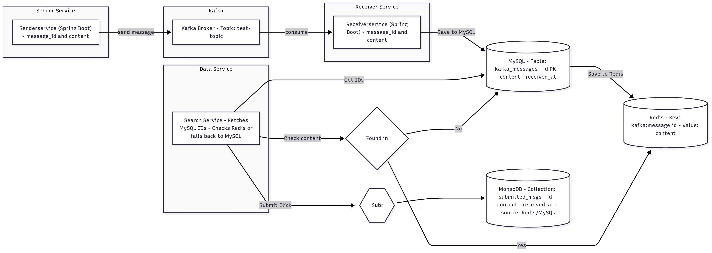

<h1>🚀 Why to Docker, Kubernetes & kind</h1>

Before we begin deploying our microservices, it's important to understand the core technologies that power our platform. This document explains why we use Docker, why Kubernetes is essential for orchestration, and why kind is our local Kubernetes cluster for Phase 1.

<h2>📦 Why Docker?</h2>

<strong>Docker</strong> allows us to package each microservice (like <code>senderservice</code>, <code>receiverservice</code>, <code>dataservice</code>) into portable containers. This ensures they run consistently across development, staging, and production.

<ul>
  <li>🛠️ Environment consistency</li>
  <li>🚀 Fast startup & performance</li>
  <li>♻️ Lightweight and portable builds</li>
  <li>📦 Isolated and reproducible deployments</li>
</ul>

In our project, each backend service is containerized using Docker and pushed to a container registry like DockerHub or Harbor.

<strong>📘 Learn more:</strong> <a href="https://docs.docker.com/get-started/" target="_blank">Docker Documentation</a>

<h2>☸️ Why Kubernetes?</h2>

<strong>Kubernetes</strong> (or K8s) is the container orchestration engine we use to deploy, manage, and scale our containerized services.

<ul>
  <li>⚙️ Automates deployment, scaling, and operations</li>
  <li>🔁 Supports rolling updates and self-healing</li>
  <li>🔐 Secure service discovery and networking</li>
  <li>📦 Declarative configuration with YAML or Helm</li>
</ul>

In this lab project, Kubernetes manages:

<ul>
  <li><strong>senderservice</strong> – Spring Boot app that publishes to Kafka</li>
  <li><strong>receiverservice</strong> – Spring Boot app that consumes Kafka and writes to MySQL/Redis</li>
  <li><strong>dataservice</strong> – Python API that queries Redis/MySQL and writes to MongoDB</li>
  <li><strong>mysql, redis, mongodb</strong> – Data stores</li>
  <li><strong>kafka + zookeeper</strong> – Message brokers</li>
</ul>

<strong>📘 Learn more:</strong> <a href="https://kubernetes.io/docs/home/" target="_blank">Kubernetes Documentation</a>

<h2>🧪 Why kind (Kubernetes IN Docker)?</h2>

<strong>kind</strong> (short for Kubernetes IN Docker) is a tool that lets us spin up a real Kubernetes cluster inside Docker containers — ideal for local development and CI testing.

<ul>
  <li>✅ Works on Mac, Linux, and Windows</li>
  <li>✅ Simulates real Kubernetes with no cloud setup</li>
  <li>✅ Fast to rebuild, easy to test with real manifests</li>
  <li>✅ Perfect for learning, prototyping, and debugging</li>
</ul>

In Phase 1 of this project, we’re using kind to build and validate our entire microservices stack before deploying to Azure AKS or AWS EKS.

<strong>📘 Learn more:</strong> <a href="https://kind.sigs.k8s.io/docs/user/quick-start/" target="_blank">kind Documentation</a>

<h2>🧱 Architecture Overview</h2>

Here's what we're deploying inside our Kubernetes cluster (via kind):

<ul>
  <li>Microservices:
    <ul>
      <li>senderservice (Spring Boot)</li>
      <li>receiverservice (Spring Boot)</li>
      <li>dataservice (Python)</li>
    </ul>
  </li>
  <li>Messaging:
    <ul>
      <li>Kafka & Zookeeper</li>
    </ul>
  </li>
  <li>Databases:
    <ul>
      <li>MySQL (relational store)</li>
      <li>Redis (in-memory cache)</li>
      <li>MongoDB (document store)</li>
    </ul>
  </li>
  <li>Platform:
    <ul>
      <li>Kubernetes (via kind)</li>
    </ul>
  </li>
</ul>

<h2>📌 Summary</h2>

<ul>
  <li>
    <strong>Docker</strong> helps us containerize and package each service.  
    <a href="https://chatgpt.com/share/6857d18a-a8c0-8001-9c67-850a90e9ddbe" target="_blank">Learn more</a>
  </li>
  <li>
    <strong>Kubernetes</strong> helps us orchestrate and run services reliably.  
    <a href="https://chatgpt.com/share/6857e648-5de0-8001-ab14-7897f0aa5989" target="_blank">Learn more</a>
  </li>
  <li>
    <strong>kind</strong> helps us prototype everything locally with real Kubernetes.  
    <a href="https://chatgpt.com/share/6857e7f1-2d24-8001-88c5-41d0bf8c0c51" target="_blank">Learn more</a>
  </li>
</ul>

This forms the foundation for our real-time microservices architecture. In the next phase, we’ll containerize each app and write Kubernetes manifests to deploy them step-by-step.

<strong>🔗 GitHub Repo:</strong> <a href="https://github.com/praveen581348/project_allinone" target="_blank">project_allinone</a>

<strong>📚 Related Docs:</strong>

<ul>
  <li><a href="./SDLC-and-DevOps-Overview.md">SDLC & DevOps Lifecycle</a></li>
  <li><a href="./application_flow.md">Microservices Application Flow</a></li>
</ul>
<h2>📚 Resources</h2>
<ol>
  <!-- GitHub Repos & Overviews -->
  <li>📦 <a href="https://github.com/praveen581348/project_allinone" target="_blank">GitHub: project_allinone</a></li>
   <li>🔁 <a href="https://github.com/praveen581348/project_allinone/blob/master/application_flow.md" target="_blank">Application Flow (GitHub)</a></li>
  <li>📋 <a href="https://github.com/praveen581348/project_allinone/blob/master/SDLC-and-DevOps-Overview.md" target="_blank">SDLC & DevOps Overview</a></li>
  
  <!-- Docker, Kubernetes, kind -->
  <li>🚀 <a href="https://github.com/praveen581348/project_allinone/blob/master/why_docker_kubernetes_kind.md" target="_blank">Why Docker, Kubernetes & kind?</a></li>
  <li>🔧 <a href="https://github.com/praveen581348/project_allinone/blob/master/why_docker_kubernetes_kind.md" target="_blank">Setup Kind Cluster</a></li>
  <li>🌐 <a href="https://github.com/praveen581348/cluster" target="_blank">Cluster Repository</a></li>
  
  <!-- Docker -->
  <li>🐳 <a href="https://chatgpt.com/share/6857d18a-a8c0-8001-9c67-850a90e9ddbe" target="_blank">Learn Docker (ChatGPT)</a></li>
  
  <!-- Kubernetes -->
  <li>☸️ <a href="https://chatgpt.com/share/6857e648-5de0-8001-ab14-7897f0aa5989" target="_blank">Learn Kubernetes (ChatGPT)</a></li>
  
  <!-- kind -->
  <li>🧪 <a href="https://chatgpt.com/share/6857e7f1-2d24-8001-88c5-41d0bf8c0c51" target="_blank">Learn kind Cluster (ChatGPT)</a></li>
  
  <!-- Spring Boot + Maven -->
  <li>🛠️ <a href="https://github.com/praveen581348/project_allinone/blob/master/why_springboot_maven.md" target="_blank">Why Spring Boot + Maven?</a></li>
  <li>🌱 <a href="https://chatgpt.com/share/685854c4-f9b4-8001-a16d-bab5320f29d5" target="_blank">Spring Boot Notes & Concepts (ChatGPT)</a></li>
  <li>📘 <a href="https://chatgpt.com/share/6859922a-e6f4-8001-864e-ba59b47ad706" target="_blank">Maven Notes (ChatGPT)</a></li>
  
  <!-- Kafka + ZooKeeper -->
  <li>📡 <a href="https://github.com/praveen581348/project_allinone/blob/master/setup_kafka_zookpeer.md" target="_blank">Setup Kafka & ZooKeeper (GitHub)</a></li>
  <li>📄 <a href="https://chatgpt.com/share/685d3b2e-485c-8001-bc5c-8c3702594e35" target="_blank">Kafka & ZooKeeper Concepts & Architecture (ChatGPT)</a></li>
  <li>📂 <a href="https://github.com/praveen581348/kafka_zookeeper" target="_blank">Kafka & ZooKeeper Repository</a></li>

   <!-- SenderService -->
   <li>🚀 <a href="https://github.com/praveen581348/project_allinone/blob/master/create_senderservice.md" target="_blank">Create SenderService – Spring Boot Kafka Producer</a></li>
   <li>📁 <a href="https://github.com/praveen581348/senderservice" target="_blank">SenderService Git Repository</a></li>
    <li>📦 <a href="https://github.com/praveen581348/project_allinone/blob/master/run_senderservice_as_pod.md" target="_blank">Run SenderService as a Pod (Kubernetes Deployment Guide)</a></li>
    <li>✅ <a href="https://github.com/praveen581348/project_allinone/blob/master/verify_senderservice_kafka.md" target="_blank">Verify SenderService Producing to Kafka</a></li>

    <!-- MySQL -->
  <li>🗄️ <a href="github.com/praveen581348/project_allinone/blob/master/setup_mysql.md" target="_blank">Setup MySQL User Guide</a></li>
  <li>💾 <a href="https://github.com/praveen581348/mysql" target="_blank">MySQL Repository</a></li>

  <!-- Redis -->
  <li>⚡ <a href="https://github.com/praveen581348/project_allinone/blob/master/what_is_Redis.md" target="_blank">What is Redis?</a></li>
  <li>🔴 <a href="https://github.com/praveen581348/project_allinone/blob/master/setup_redis_guide.md" target="_blank">Setup Redis Guide</a></li>
  <li>📚 <a href="https://github.com/praveen581348/redis" target="_blank">Redis Repository</a></li>

  <!-- MongoDB -->
  <li>🍃 <a href="https://github.com/praveen581348/project_allinone/blob/master/setup_mongodb.md" target="_blank">MongoDB Setup Guide</a></li>
  <li>🧩 <a href="https://github.com/praveen581348/mongodb" target="_blank">MongoDB Repository</a></li>

</ol>